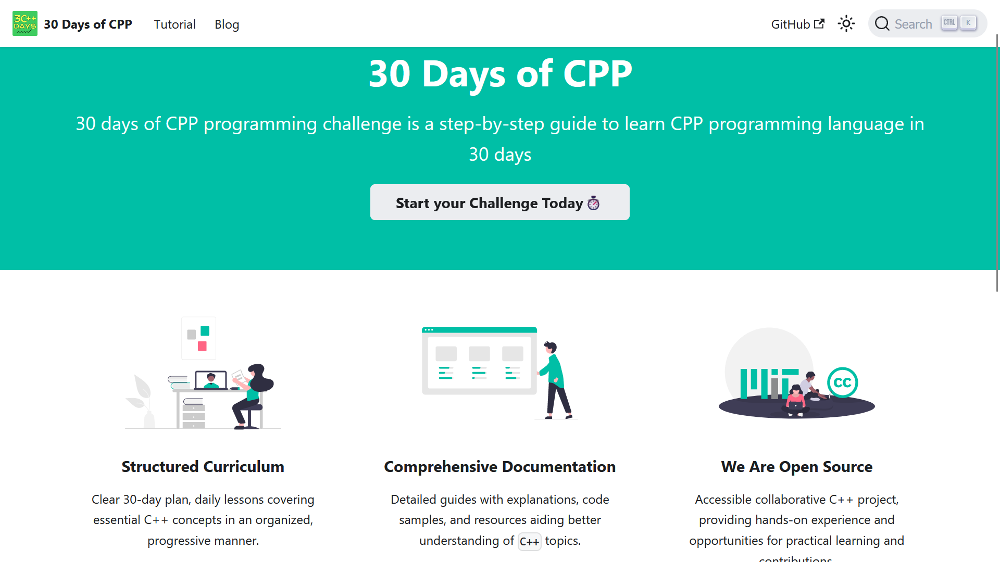

# 30 Days of CPP

Welcome to the 30 Days of CPP challenge! 30 days of CPP programming challenge is a step-by-step guide to learn CPP programming language in 30 days. visit the [30-days-of-cpp](https://subhadipbhowmik.github.io/30-Days-Of-CPP/) to learn more about the project.




## What is 30 Days of CPP?

30 Days of CPP is a programming challenge designed to help individuals enhance their proficiency in C++ by solving daily coding problems, implementing algorithms, and exploring various aspects of the language.


# Contributor's Guide 🧑🏻‍💻
We appreciate your interest in contributing. 💐 This guide will help you get started with the project and make your first contribution.


## 🌟 Creating Your First Pull Request

1. **Star this repository.**
2. **Fork this repository.**
3. **Clone the forked repository:**
    ```bash
    git clone https://github.com/<your-github-username>/30-Days-Of-CPP.git
    ```
    - If you have already forked the project, update your copy before working:
    ```bash
    git remote update
    ```
4. **Navigate to the project directory:**
    ```bash
    cd 30-Days-Of-CPP
    ```
5. **Set an upstream with the parent repository and local repository:**
    ```bash
    git remote add upstream https://github.com/subhadipbhowmik/30-Days-Of-CPP.git
    ```
    - If you have altered it, you have to rebase it:
    ```bash
    git rebase upstream/<branch_name>
    ```
6. **Create a new branch:**
    ```bash
    git checkout -b <your_branch_name>
    ```
    Branch name example: 
    feature/added-day1-content
    or,
    bug/search-not-working
7. **Make changes.**
    Do the Necessary changes in the code or files.

8. **Stage your changes and commit:**
    ```bash
    git add .
    git commit -m "<your_commit_message>"
    ```
9. **Push your local commits to the remote repo:**
    ```bash
    git push -u origin <your_branch_name>
    ```
10. **Create a Pull Request.**
    - Go to your forked repository on GitHub.
    - Click on the "Compare & pull request" button.
    - Write a title and description for your pull request.
    - Click on the "Create pull request" button.
    - **Important:** Make sure to mention the issue number in the pull request description. For example, "Fixes #1".
    - **Note:** Do not close the issue until it is approved.

11. **Congratulations! 🎉 you've made your contribution.**


## 📝 Project Overview
---

- **Structured Curriculum:**
  Clear 30-day plan, daily lessons covering essential C++ concepts in an organized, progressive manner.

- **Comprehensive Documentation:**
  Detailed guides with explanations, code samples, and resources aiding better understanding of C++ topics.

- **Open Source Project:**
  Accessible collaborative C++ project, providing hands-on experience and opportunities for practical learning and contributions.

- **Free Access:**
  Entire program, resources, and materials accessible at no cost, ensuring inclusivity for all interested learners.

- **Informative Blogs:**
  Regularly updated blogs covering diverse C++ topics, offering supplementary insights and knowledge beyond lessons.

- **Community Engagement:**
  Supportive community fostering interaction, collaboration, and learning through discussions and shared experiences among participants.

---

## Learn Aout Our Project

If you want to learn more about our project, you can visit our [Learn Page](Learn.md)

## Contributing

If you would like to contribute additional exercises, improvements, or corrections to existing code, feel free to open a pull request. Your contributions are highly appreciated! Read the [CONTRIBUTING.md](CONTRIBUTING.md) file for more information.

Happy coding!


## License

This project is licensed under the MIT License - see the [LICENSE](LICENSE) file for details.
