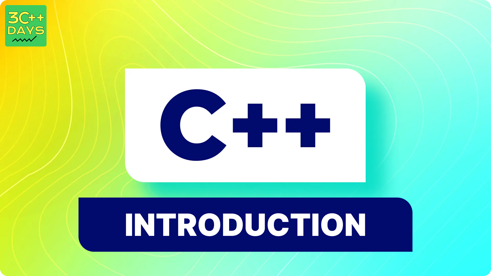

import CustomTag from '@site/src/components/TagsComponents/CustomTag';

## OOPS Features
Object-oriented programming (OOP) in C++ focuses on using objects as the primary means of structuring code. The goal of OOP is to model real-world entities through features such as inheritance, encapsulation, polymorphism, and more. The core idea is to encapsulate data and the functions that manipulate it, ensuring that data is only accessible through these functions, thereby promoting data security and integrity.

The fundamental concepts of OOP are:

- Class
- Objects
- Encapsulation
- Abstraction
- Polymorphism
- Inheritance
- Dynamic Binding
- Message Passing

Characteristics of an Object-Oriented Programming Language

1. Class

In C++, the fundamental unit that facilitates Object-Oriented programming is a Class. A class is a user-defined data type that encapsulates data members and member functions. These can be accessed and utilized by creating an instance of the class. Think of a class as a template for an object. For example, consider the Class of Cars. There are various cars with different brands and names, but they all share common characteristics, such as having four wheels, speed limits, and mileage ranges. Here, the Car is the class, and the wheels, speed limits, and mileage are its properties.

A Class is a user-defined data type composed of data members and member functions.
- Data members are the variables that store data.
- Member functions are the functions that operate on these variables.

Together, these data members and member functions define the properties and behaviors of the objects created from the class.

In the Car class example, the data members might include the speed limit and mileage, while the member functions could be those that apply brakes or increase speed. Essentially, a Class in C++ acts as a blueprint that represents a group of objects sharing common properties and behaviors.


2. Object


An Object is a distinct entity with specific attributes and behavior. It is an instance of a Class. Defining a class does not allocate memory, but memory is allocated when an object is created from the class. Objects occupy memory space and have a specific address, similar to records in Pascal or structures and unions in other programming languages. During program execution, objects interact by sending messages to each other. Each object encapsulates data and the code that manipulates this data. Objects can communicate without needing to know the details of each other’s data or code; they only need to know the types of messages accepted and the responses expected from the objects.

3. Encapsulation

In simple terms, Encapsulation means wrapping data and information into a single unit. In Object-Oriented Programming, Encapsulation refers to combining data and the functions that manipulate that data into a single entity. For instance, in a company, there are various departments like accounts, finance, and sales. The finance department manages all financial transactions and keeps financial records, while the sales department handles sales activities and maintains sales records. If a finance officer needs sales data for a particular month, they cannot directly access the sales records. Instead, they must request the information from a sales officer. This process exemplifies encapsulation.


4. Abstraction

Data abstraction is a key feature of object-oriented programming in C++. Abstraction involves showing only the necessary details and hiding the complex implementation. Data abstraction means presenting only the essential information about data to the outside world, while concealing the underlying details or implementation. For example, when a person drives a car, they know that pressing the accelerator will make the car go faster and applying the brakes will make it stop. However, they do not need to understand the internal mechanics of how the accelerator increases speed or how the brakes work. This concept illustrates abstraction.


5. Polymorphism

Polymorphism, which means "many forms," refers to the ability of a message or function to be displayed in multiple ways. It allows objects to be treated as instances of their parent class rather than their actual class. For example, a person can simultaneously be a father, a husband, and an employee, exhibiting different behaviors in different contexts. This is an example of polymorphism. In programming, an operation can behave differently based on the data types involved. 

C++ supports polymorphism through operator overloading and function overloading:

- **Operator Overloading**: This allows an operator to perform different operations based on the context.
- **Function Overloading**: This involves using the same function name to perform different tasks, depending on the input parameters.

Polymorphism is a fundamental concept used extensively in implementing inheritance in C++.


6. Inheritance

Inheritance is the ability of a class to acquire properties and characteristics from another class. It is a fundamental feature of Object-Oriented Programming.

- **Sub Class**: Also known as a Derived Class, this is the class that inherits properties from another class.
- **Super Class**: Also known as a Base Class, this is the class whose properties are inherited by the subclass.
- **Reusability**: Inheritance promotes the concept of reusability. When creating a new class, if an existing class already contains some of the desired functionality, the new class can be derived from the existing one. This way, the fields and methods of the existing class are reused in the new class.

7. Dynamic Binding

In dynamic binding, the code to be executed in response to the function call is decided at runtime. C++ has virtual functions to support this. Because dynamic binding is flexible, it avoids the drawbacks of static binding, which connected the function call and definition at build time.

8. Message Passing

Objects communicate with one another by sending and receiving information. A message for an object is a request for the execution of a procedure and therefore will invoke a function in the receiving object that generates the desired results. Message passing involves specifying the name of the object, the name of the function, and the information to be sent.



## Getting Started

To start programming in C++, you'll need a development environment with a C++ compiler. Popular compilers include GCC, Clang, and Microsoft Visual C++. You can choose an Integrated Development Environment (IDE) like Visual Studio, Code::Blocks, or CLion to write and compile your code efficiently.

Here's a simple "Hello, World!" example in C++:

```cpp
#include <iostream>

int main() {
    std::cout << "Hello, World!" << std::endl;
    return 0;
}
```

Save this code in a file with a `.cpp` extension, compile it using a C++ compiler, and execute the resulting program to see the output.

## What's Next?

- **Learn Basic Syntax**: Dive into the syntax, data types, control structures, and functions in C++.
- **Explore Advanced Concepts**: Study topics like pointers, memory management, templates, and exception handling.
- **Practice, Practice, Practice**: Solve programming challenges and work on projects to reinforce your learning.
- **Refer Official Documentation**: Utilize online resources, books, and official C++ references to deepen your understanding.

C++ is a vast language with numerous possibilities. Enjoy your journey in mastering this versatile programming language!

---

Feel free to expand upon this content and include more details, examples, or exercises based on your audience's needs and the depth of the tutorial you're planning to create.
