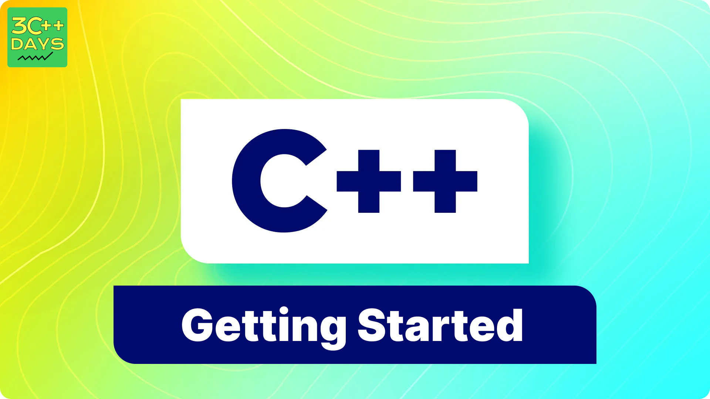

import BackToTop from '@site/src/components/BackToTop/BackToTop';
import CustomTag from '@site/src/components/TagsComponents/CustomTag';

C++ is a general-purpose programming language and is widely used nowadays for competitive programming. It has imperative, object-oriented, and generic programming features. 
C++ runs on lots of platforms like Windows, Linux, Unix, Mac, etc. Before we start programming with C++. We will need an environment to be set up on our local computer to compile and run our C++ programs successfully. If you do not want to set up a local environment you can also use online IDEs for compiling your program.

## 1. Installation Process Step By Step

## Windows:
### Visual Studio:
 If you’re using Windows, you can install Visual Studio, which provides a powerful IDE for C++ development. Follow these steps:
- Make sure your computer meets the system requirements for Visual Studio 2022.
- Apply the latest Windows updates.Free up space on your system drive.
- Download the Visual Studio bootstrapper file from the Visual Studio download page.
### MinGW (Minimalist GNU for Windows): 
- Alternatively, you can use MinGW to install GCC (GNU Compiler Collection) for C++ development. Here’s how:
- Download MinGW from the official website.
- Install MinGW and choose the components you need (e.g., g++, gdb).Set up the path environment variable to include  the MinGW bin folder
## Mac OS:
To install GCC on Mac OS, follow these steps:
- Open Terminal.
- Install Xcode Command Line Tools (if not already installed) by running: xcode-select --install.
- Install Homebrew (a package manager for Mac) by following the instructions on the Homebrew website.
- Install GCC using Homebrew: brew install gcc.
## Linux:
On Linux, you can easily install GCC using your package manager. For example:
- On Ubuntu/Debian: sudo apt-get install g++
- On Fedora: sudo dnf install gcc-c++
- On CentOS/RHEL: sudo yum install gcc-c++

## 2. How to run a CPP program
### Write Your C++ Code:
Open a text editor (such as Notepad, Visual Studio Code, or any other code editor).
Write your C++ code. Make sure it has the .cpp extension (e.g., my_program.cpp).

## 3. How to compile a CPP program
### Visual Studio Code (VS Code):
If you’re using VS Code, you can set up your C++ environment as follows:
- Install the C/C++ extension for VS Code by searching for “C++” in the Extensions view and selecting Install.
- Make sure you have a C++ compiler installed. You can use MinGW on Windows, GCC on Linux, or Clang on macOS.
Write your C++ code in a .cpp file.
- Open a terminal in VS Code and navigate to the directory containing your .cpp file.
#### Compile your code using the appropriate compiler command:
- For MinGW: g++ -o my_program my_program.cpp
- For GCC: g++ -o my_program my_program.cpp
- For Clang: clang++ -o my_program my_program.cpp
- Run your compiled program: ./my_program1.

<BackToTop />