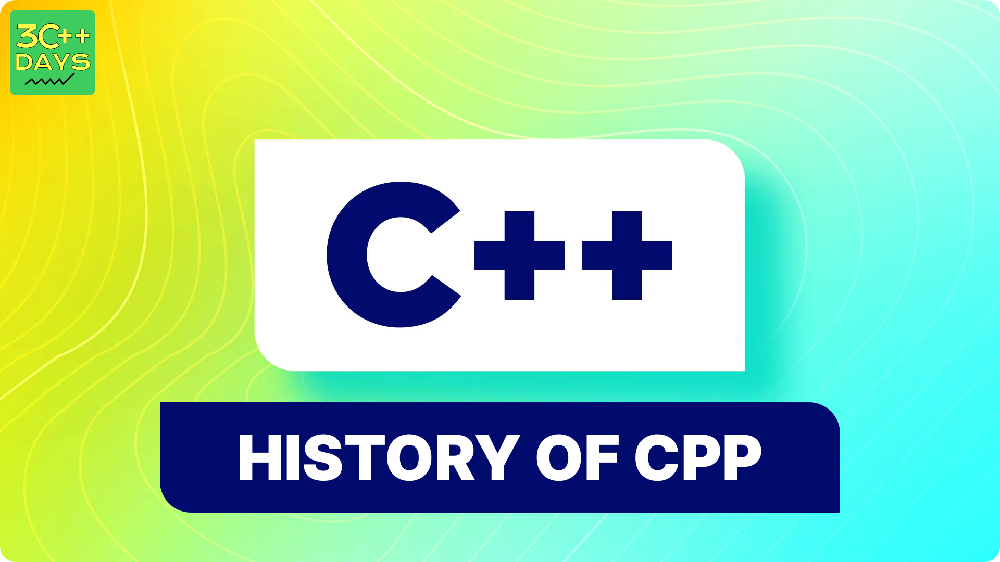

import BackToTop from '@site/src/components/BackToTop/BackToTop';

## History of CPP

C++ has a rich history that began in the late 1970s and has evolved significantly since then. Here's a timeline of its key milestones:

1979: Birth of C++

- Developed by Bjarne Stroustrup at Bell Labs (AT&T): Stroustrup wanted to extend the C language with features for object-oriented programming (OOP) while maintaining its efficiency and familiarity.
- Initial Goal: Simula Features in C: Stroustrup aimed to incorporate the program organization and concurrency concepts from Simula, a language known for its strong OOP foundation, into C.

1980s: Early Development and Standardization Efforts

- C with Classes (Cwc): The initial name of C++ reflected its focus on adding class-based OOP features to C.
- Language Refinement: New functionalities like inheritance, virtual functions, and operator overloading were gradually introduced.
- Standardization Discussions: Discussions began around creating a standard for C++ to ensure consistency and portability across different compiler implementations.

1983: First Public Release

- Initial Availability: The first public release of C++ allowed programmers to experiment with the language and its capabilities.

1985: The Annotated C++ Reference Manual

- A Critical Resource: This comprehensive manual by Bjarne Stroustrup documented the language features and became a valuable reference for C++ programmers.

1989-1991: Standardization Takes Center Stage

- Standardization Efforts Intensify: Collaboration between major players like HP, AT&T, DEC, and IBM led to a formal standardization process.
- ANSI Standardization (C++98): The first official C++ standard, C++98, was established, providing a stable foundation for the language.

1990s and Beyond: Continued Growth and Evolution

- Standard Library Expansion: The C++ Standard Library was enhanced with essential components like the Standard Template Library (STL) for generic programming.
- Focus on Features and Performance: New features like templates, exceptions, and improved performance optimizations were introduced in subsequent standards (C++03, C++11, C++14, etc.).
- Modern C++: With the C++11 standard and beyond, the language embraced features like move semantics, lambda expressions, and range-based for loops, making it more expressive and powerful for modern programming tasks.

Present Day: A Thriving Language

- Widely Used: C++ remains a dominant language for system programming, game development, high-performance computing, and embedded systems due to its efficiency and control over hardware resources.
- Active Standardization: The C++ standardization committee continues to work on new features and improvements, with the latest standard being C++20 (released in 2020) and C++23 planned for the future.


C++ has come a long way from its origins as an extension of C, evolving into a robust and versatile language for various programming domains. Its balance of performance, control, and modern features allows developers to create complex, efficient, and maintainable software applications.


## What is C++?

C++ is an extension of the C programming language with added features such as object-oriented programming (OOP) capabilities. It provides a robust set of tools and allows low-level memory manipulation while also supporting high-level abstractions. Known for its efficiency and performance, C++ is often chosen for applications that require speed and resource management.This language allows developers to write clean and efficient code for large applications and software development, game development, and operating system programming. It is an expansion of the C programming language to include Object Oriented Programming(OOPs) and is used to develop programs for computers. This C++ Tutorial will cover all the basic to advanced topics of C++ like C++ basics, C++ functions, C++ classes, OOPs and STL concepts.



## Key Features of C++

### Object-Oriented Programming (OOP)

C++ supports the principles of OOP, enabling developers to create classes, objects, inheritance, polymorphism, encapsulation, and abstraction. This paradigm helps in organizing and structuring code for better maintainability and reusability.

### Standard Template Library (STL)

The Standard Template Library in C++ provides a collection of classes and functions that implement various common data structures (like arrays, vectors, lists, maps) and algorithms (such as sorting, searching). This library simplifies complex tasks and enhances productivity.

### Performance and Efficiency

C++ allows fine-tuning of performance-critical parts of code by providing control over memory management and offering features like inline functions, which can significantly enhance execution speed.

### Portability

C++ code can be compiled on different platforms with minimal changes, making it a portable language suitable for cross-platform development.

## Getting Started

To start programming in C++, you'll need a development environment with a C++ compiler. Popular compilers include GCC, Clang, and Microsoft Visual C++. You can choose an Integrated Development Environment (IDE) like Visual Studio, Code::Blocks, or CLion to write and compile your code efficiently.

Here's a simple "Hello, World!" example in C++:

```cpp
#include <iostream>

int main() {
    std::cout << "Hello, World!" << std::endl;
    return 0;
}
```

Save this code in a file with a `.cpp` extension, compile it using a C++ compiler, and execute the resulting program to see the output.

## What's Next?

- **Learn Basic Syntax**: Dive into the syntax, data types, control structures, and functions in C++.
- **Explore Advanced Concepts**: Study topics like pointers, memory management, templates, and exception handling.
- **Practice, Practice, Practice**: Solve programming challenges and work on projects to reinforce your learning.
- **Refer Official Documentation**: Utilize online resources, books, and official C++ references to deepen your understanding.

C++ is a vast language with numerous possibilities. Enjoy your journey in mastering this versatile programming language!

---

Feel free to expand upon this content and include more details, examples, or exercises based on your audience's needs and the depth of the tutorial you're planning to create.

<BackToTop />