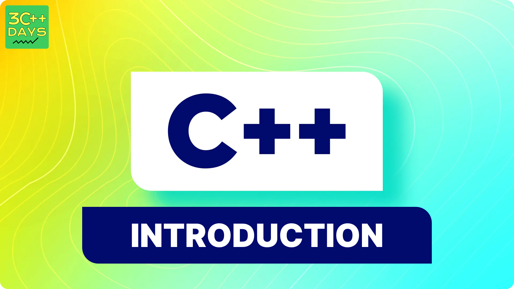

import BackToTop from '@site/src/components/BackToTop/BackToTop';
import CustomTag from '@site/src/components/TagsComponents/CustomTag';

## Introduction to C++

C++ is a general-purpose programming language that was developed as an enhancement of the C language to include object-oriented paradigm. It is an imperative and a compiled language.C++ is a powerful and versatile programming language that is widely used for a range of applications and is well-suited for both low-level system programming and high-level application development.C++ is a middle-level language rendering it the advantage of programming low-level (drivers, kernels) and even higher-level applications (games, GUI, desktop apps etc.). The basic syntax and code structure of both C and C++ are the same. 

#### Some of the key points to note about the programming language are as follows:

- Simple: It is a simple language in the sense that programs can be broken down into logical units and parts, has a rich library support and a variety of data-types.
- Machine Independent but Platform Dependent: A C++ executable is not platform-independent (compiled programs on Linux won’t run on Windows), however they are machine independent.
- Mid-level language: It is a mid-level language as we can do both systems-programming (drivers, kernels, networking etc.) and build large-scale user applications (Media Players, Photoshop, Game Engines etc.)
- Rich library support: Has a rich library support (Both standard ~ built-in data structures, algorithms etc.) as well 3rd party libraries (e.g. Boost libraries) for fast and rapid development.
- Speed of execution: C++ programs excel in execution speed. Since, it is a compiled language, and also hugely procedural. Newer languages have extra in-built default features such as garbage-collection, dynamic typing etc. which slow the execution of the program overall. Since there is no additional processing overhead like this in C++, it is blazing fast.
- Pointer and direct Memory-Access: C++ provides pointer support which aids users to directly manipulate storage address. This helps in doing low-level programming (where one might need to have explicit control on the storage of variables).
- Object-Oriented: One of the strongest points of the language which sets it apart from C. Object-Oriented support helps C++ to make maintainable and extensible programs. i.e. Large-scale applications can be built. Procedural code becomes difficult to maintain as code-size grows.
- Compiled Language: C++ is a compiled language, contributing to its speed.



## Key Features of C++

### Object-Oriented Programming (OOP)

C++ supports the principles of OOP, enabling developers to create classes, objects, inheritance, polymorphism, encapsulation, and abstraction. This paradigm helps in organizing and structuring code for better maintainability and reusability.

### Standard Template Library (STL)

The Standard Template Library in C++ provides a collection of classes and functions that implement various common data structures (like arrays, vectors, lists, maps) and algorithms (such as sorting, searching). This library simplifies complex tasks and enhances productivity.

### Performance and Efficiency

C++ allows fine-tuning of performance-critical parts of code by providing control over memory management and offering features like inline functions, which can significantly enhance execution speed.

### Portability

C++ code can be compiled on different platforms with minimal changes, making it a portable language suitable for cross-platform development.

## Getting Started

To start programming in C++, you'll need a development environment with a C++ compiler. Popular compilers include GCC, Clang, and Microsoft Visual C++. You can choose an Integrated Development Environment (IDE) like Visual Studio, Code::Blocks, or CLion to write and compile your code efficiently.

Here's a simple "Hello, World!" example in C++:

```cpp
#include <iostream>

int main() {
    std::cout << "Hello, World!" << std::endl;
    return 0;
}
```

Save this code in a file with a `.cpp` extension, compile it using a C++ compiler, and execute the resulting program to see the output.

## What's Next?

- **Learn Basic Syntax**: Dive into the syntax, data types, control structures, and functions in C++.
- **Explore Advanced Concepts**: Study topics like pointers, memory management, templates, and exception handling.
- **Practice, Practice, Practice**: Solve programming challenges and work on projects to reinforce your learning.
- **Refer Official Documentation**: Utilize online resources, books, and official C++ references to deepen your understanding.

C++ is a vast language with numerous possibilities. Enjoy your journey in mastering this versatile programming language!

---

Feel free to expand upon this content and include more details, examples, or exercises based on your audience's needs and the depth of the tutorial you're planning to create.

<BackToTop />