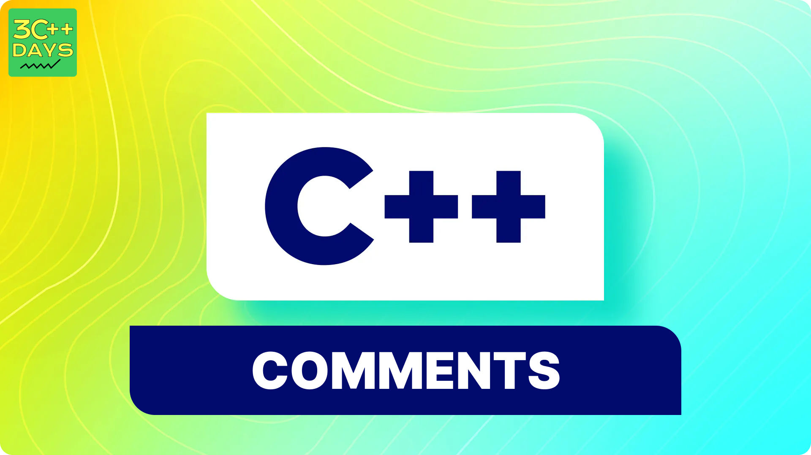

## 1. What is Comment in C++?
- A comment in C++ is a programmer-readable note that is inserted directly into the source code of a program.
- Comments are ignored by the compiler and are meant for the programmer’s use only.
- They serve as a form of in-code documentation, helping developers understand the purpose, logic, or explanation behind specific code lines
  
## 2. Why do we use comments in C++?
Comments serve several purposes:
- Explanation: They explain the code, making it more readable and understandable for other programmers.
- Debugging: Comments can be useful for debugging by providing context or temporarily disabling code segments.
- Documentation: They document algorithms, variable purposes, or clarify unclear code segments.
- Collaboration: Comments help other developers understand your code when collaborating on projects.



## 3. Write a simple program to demonstrate the use of comments in C++.
```cpp
#include <iostream>
using namespace std;

int main() {
    // This is a single-line comment
    cout << "Hello, World!"; // Another single-line comment
    return 0;
}
```
In this program, we use both single-line comments (//) to explain the code and prevent execution of those comment lines
## 4. Types of comments in C++
 i. Single Line Comment
- Starts with // and applies to a single line only.
- Compiler ignores any text after //.
- Used for brief explanations or annotations within a line of code.
Example:
``` cpp
int age = 25; // Stores the user's age

```
   ii. Multi Line Comment
- Starts with /* and ends with */.
- Can span multiple lines but cannot be nested.
- Any text between /* and */ is ignored by the compiler.
- Used for longer descriptions, explaining complex logic or function purposes.
Example:
```cpp
/*
* This function calculates the area of a rectangle
* given its length and width.
*/
int calculateArea(int length, int width) {
  // ... function implementation
}

 ```
   iii. Documentation Comment
- Used for documenting functions, classes, and their parameters.
- Typically starts with /** and ends with */.
- Contains additional information for tools like Doxygen.
- Example (not standard C++):
```cpp
/**
 * @param x integer value to add
 * @param y integer value to add
	@@ -66,3 +75,4 @@ int add(int x, int y) {
}
```

By effectively using comments, you can improve the understandability and maintainability of your C++ programs, both for yourself and others who may read your code in the future.
