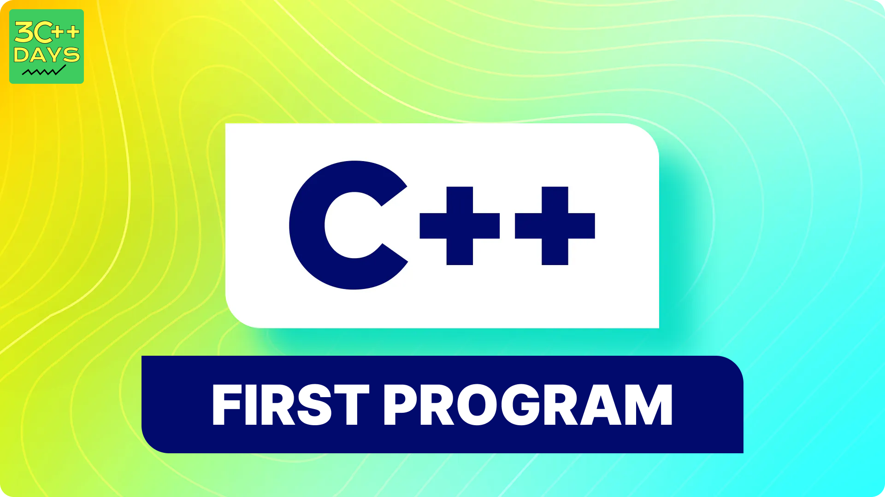

import BackToTop from '@site/src/components/BackToTop/BackToTop';

## Your First Steps in C++: Hello, World!

Welcome to the exciting world of C++ programming! Today, we'll embark on a journey together, crafting our very first C++ program - the classic "Hello, World!". This simple program lays the foundation for understanding core C++ concepts.

### Setting Up

Before diving into code, you'll need a text editor or an Integrated Development Environment (IDE) to write and compile your C++ program. Popular choices include Notepad++, Visual Studio Code, or Code::Blocks.

 

### Write a Simple "Hello, World!" Program in C++

```
#include <iostream>

int main() {
  std::cout << "Hello, World!" << std::endl;
  return 0;
}

```
### 2. Output of the program.
When you run this program, it will display the following output:
``` 
Hello, World!
```
You'll need a C++ compiler to run this program. Here's a general process:

- Save the code in a file with a `.cpp` extension (e.g., `hello_world.cpp`).
- Compile the code using a C++ compiler. The specific command will vary depending on your compiler.
- Execute the compiled program (the generated executable file).

 

### 3. Explain the code line by line.

1. `#include <iostream>`: This line is called a preprocessor directive. It instructs the compiler to include the contents of the `<iostream> `header file. This header file provides essential input/output functionalities like cout for printing to the console.


2. `int main()`: This line declares the main function, which is the program's entry point. The int keyword specifies that the main function will return an integer value (usually 0 to indicate successful execution).


3. { }: The curly braces mark the beginning and end of the code block for the main function. All the statements within this block will be executed when the program runs.

4. std::cout &gt; &gt; "Hello, World!" &gt; &gt; std::endl;: This line is the heart of the program. It performs the following actions:

   - std::cout: This is an object of the ostream class (from &gt;iostream&lt;) used for standard output (printing to the console).
   - &gt; &gt;: This is the stream insertion operator. It's used to send data to the output stream (cout) on the left side.
   - "Hello, World!": This is the actual string literal that you want to print.
   - std::endl: This manipulator inserts a newline character after the string, ensuring the output appears on a new line.
5. return 0; : This line exits the main function and returns the value 0 to the operating system. A return value of 0 typically indicates successful program execution.

### 4. Explain Basic Structure of C++ Program.
1. Preprocessor Directives (Optional):

- Lines starting with `#`.
- Not actual C++ statements but instructions for the preprocessor (a separate program that runs before compilation).
- Common example: `#include <iostream>` - This includes the `iostream` header file, providing input/output functionalities like cout for printing to the console.
2. Namespaces (Optional):

- Lines using the `namespace` keyword.
- Help organize code by grouping related elements (like functions, classes) under a specific namespace.
- Common example: `using namespace std;` - This brings the std namespace (containing standard objects like `cout`) into scope, avoiding repetitive use of `std::`.
3. Function Definitions:

- Functions are reusable blocks of code that perform specific tasks.
- Defined using a return type, name, parameter list (optional), and a code block within curly braces `({})`.
- The `main` function is the entry point of the program, where execution begins.
4. Variable Declarations:

Variables store data during program execution.
Declared using a data type (e.g., `int`, `double`) and a name following specific naming rules (letters, numbers, underscores, case-sensitive).
Example: `int age = 25;` - Declares an integer variable `age` and initializes it with the value 25.
5. Statements:

Lines that perform actions or control the program flow.
Examples:
 - `cout << "Hello, World!" << endl;` - Prints "Hello, World!" to the console.
 - `if (age >= 18) { ... }` - Conditional statement to check if age is greater than or equal to 18 and execute code within the block if true.
 - `for (int i = 0; i < 3; i++) { ... }` - Loop that iterates three times.
6. Comments (Optional):

- Lines starting with `//` (single line comment) or `/* ... */` (multi-line comment).
- Provide explanations within the code for better understanding.
- Ignored by the compiler but essential for human-readable code.
Here's a basic program structure summarizing these elements:
```
C++
#include <iostream> // Preprocessor directive (optional)

using namespace std; // Namespaces (optional)

// Function definitions
int main() {
  // Variable declarations and statements
  cout << "Hello, World!" << endl;
  return 0;
}
```


Remember, this is a basic structure, and more complex programs may involve additional elements like classes, objects, and header files for custom functions.

<BackToTop />