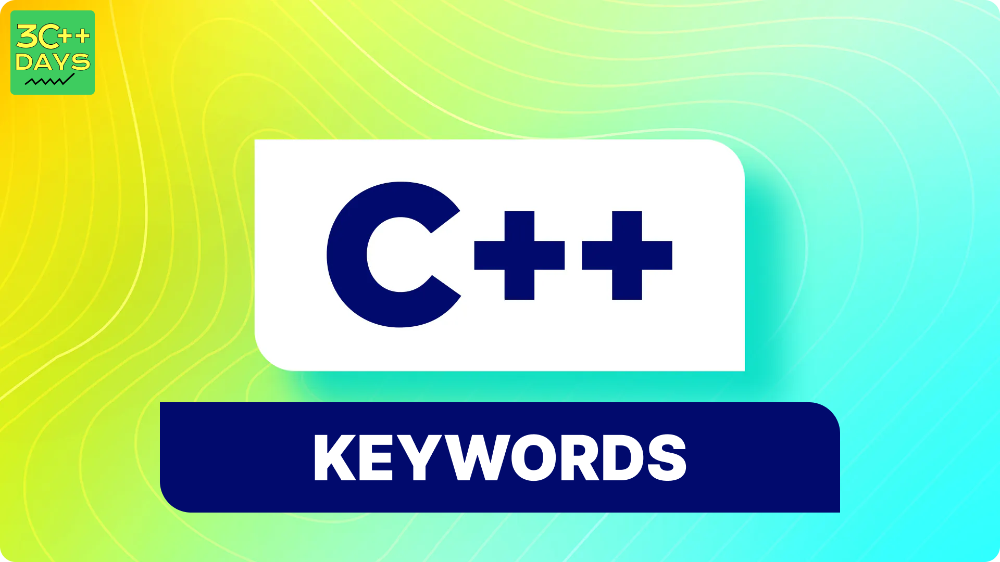

### 1. What is Keywords and Identifiers in C++?

## Keywords:
- Keywords are predefined words that have special meanings to the C++ compiler.
- They are part of the language syntax and serve specific purposes.
- They are always written in lowercase in   C++.
- It have a fixed set(around 32 in C++)that doesn't change.
- For example, int, if, while, and class are keywords.
- Keywords cannot be used as identifiers (variable names, function names, etc.) because they already have predefined meanings.
## Identifiers:
- Identifiers are unique names given to variables, functions, classes, and other entities by the programmer.
- They help us create meaningful and descriptive names for program elements.
- Examples of identifiers: money, accountBalance, studentAge, and calculateSum.
- Must follow the below specific naming rules:

### Rules for naming identifiers:
- Can consist of letters (A-Z or a-z), digits (0-9), and underscores (_).
- Must begin with a letter or an underscore.
- Are case-sensitive (e.g., Num and num are different).
- Cannot use reserved keywords as identifiers.
- Must be unique within their namespace (e.g., no two variables with the same name in the same scope)31.
### 2. Why do we use Keywords and Identifiers in C++?
#### we use keywords:
- Syntax: Keywords define the syntax and structure of the language. They help the compiler understand the code.
- Reserved Meanings: Each keyword has a reserved purpose (e.g., if for conditional statements, while for loops, class for defining classes).
- Consistency: Using keywords ensures consistency across different C++ programs.
- Efficiency: Keywords allow the compiler to optimize code execution.
- Readability: They make the code more readable and self-explanatory.
#### we use identifiers:
- Descriptive Names: Identifiers give meaningful names to program entities (e.g., totalAmount, calculateAverage).
- Readability: Well-chosen identifiers enhance code readability for both programmers and collaborators.
- Avoid Magic Numbers: Instead of using raw numbers (e.g., 42), we use identifiers (e.g., MAX_SCORE) to make the code self-documenting.
- Modularity: Identifiers help organize code into logical units (functions, classes, etc.).
- Avoid Confusion: Descriptive identifiers prevent confusion and improve maintainability.
### 3. Write a simple program to demonstrate the use of Keywords and Identifiers in C++.
```cpp
#include <iostream>

using namespace std;

int main() {
  // Integer variable to store age (identifier)
  int age = 25;

  // `if` is a keyword for conditional statement
  if (age >= 18) {
    cout << "You are eligible to vote." << endl;
  }

  // `for` is a keyword for loop
  for (int i = 0; i < 3; i++) {
    cout << "Iteration: " << i << endl;
  }

  // `double` is a keyword for floating-point numbers (identifier)
  double pi = 3.14159;
  cout << "Value of pi: " << pi << endl;

  // `calculateArea` is a user-defined identifier (function name)
  int area = calculateArea(5, 4); // Assuming calculateArea is defined elsewhere
  cout << "Area of rectangle: " << area << endl;

  return 0;
}

// This function (identifier) is not defined here, but for demonstration purposes
int calculateArea(int length, int width) {
  return length * width;
}
```

### 4. List of Keywords in C++
C++ has a set of around 32 keywords that have special meanings within the language. Here's a list for your reference:
- Basic data types: int, float, double, char, bool
- Storage specifiers: auto, register, static, extern
- Type specifiers: void, const, volatile
- Control flow: if, else, for, while, do, switch, case, break, continue, return
- Function definitions: inline, friend, virtual
- Object-oriented programming: class, struct, public, private, protected, this, new, delete
- Exception handling: try, catch, throw
- Other: sizeof, namespace, template, typedef
``Note``: This is not an exhaustive list, and the exact number of keywords may vary slightly depending on the C++ version you're using. It's always a good practice to refer to the official C++ documentation for the latest keyword definitions.
### 5. Rules for defining Identifiers in C++
Remember these rules when defining identifiers:
- Must start with a letter or underscore. Cannot start with a digit.
- Consist of letters, digits, and underscores.
- Avoid using reserved keywords as identifiers.
- Be case-sensitive (e.g., myVar and MyVar are different).
- No limit on the length of an identifier.
- Cannot be the same as keywords in C++.
### 6. Examples of Identifiers in C++
#### Valid Identifiers: 
 - Starts with letter or underscore
  `age`, `_temporary`, `myObject`
 - Can contain letters, digits, and underscores
  `calculate_area`, `x123`
 - Case-sensitive
    `age`, `Age`
 - Cannot be a keyword	
    `cpp_keyword` (not recommended)
#### Invalid Identifiers: 
-  Starts with a number
    `1st_place` 
-  Contains hyphen
    `my-function`
-  Keywords
   `int`,`while`
### 7. Difference between Keywords and Identifiers in C++
- Keywords are predefined words with specific meanings in the language , while identifiers are user-defined names for program elements.
- Keyword can control flow and structure but Identifiers, identify program elements.
- Keywords cannot be used as identifiers.On the other hand, identifiers used for variables , functions , classes , etc.
- Keywords have fixed set, lowercase only but , identifiers defined by programmer , case sensitive.
- Examples of keyword: `int`,`if`,`while`,`class`.
- Examples of identifier: `age`,`calculateArea`,`myObject`.