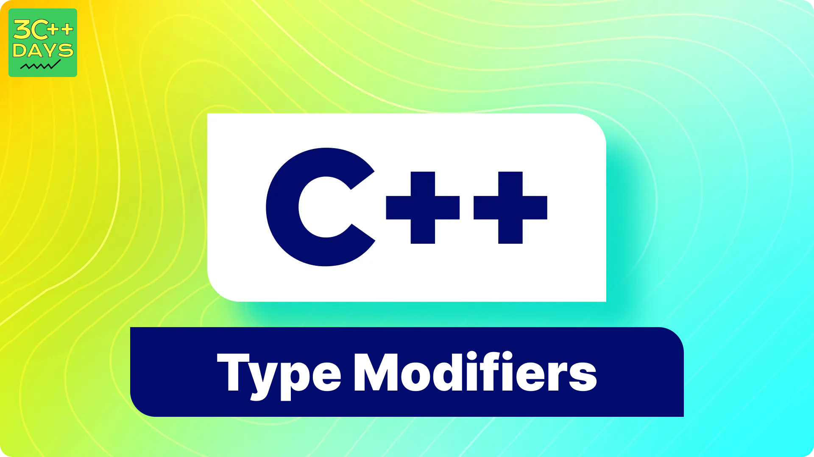

import BackToTop from '@site/src/components/BackToTop/BackToTop';

### 1. What is Type Modifiers in C++?
Type modifiers in C++ are keywords that you use to alter the meaning of the basic data types to fit specific needs of your program. They allow you to specify more precisely the properties of variables, such as their size and whether they can hold negative values. The primary type modifiers in C++ are `short`, `long`, `signed`, and `unsigned`.


### 2. Types of Type Modifiers in C++ with Proper Examples.
#### Types of Type Modifiers in C++:
- `short`
- `long`
- `signed`
- `unsigned`
- `long long`
- `short int`
- `long int`
- `long double`



### 3. short type Modifier
The `short` modifier reduces the size of the `int` data type. Typically, a `short int` is at least 16 bits.
```cpp
short a; // Declares a short integer variable
short int b; // Equivalent to short a
```
### 4. long type Modifier
The `long` modifier increases the size of the `int` data type. Typically, a `long int` is at least 32 bits.

Example:

```cpp
long a; // Declares a long integer variable
long int b; // Equivalent to long a
```
### 5. signed type Modifier
The `signed` modifier allows a data type to store both positive and negative values. By default, integer types are `signed`.

Example:

```cpp

signed int a; // Explicitly declares a signed integer variable
signed char b; // Declares a signed character variable
```
### 6. unsigned type Modifier
- These modifiers can be used with `int` and `char` data types.
- `Signed` variables can hold both positive and negative integers, including zero.
- By default, integers are `signed`, so we can directly use `int`.
- `unsigned` variables can hold only non-negative integer values.
Example:
```cpp
signed int x = 23; // Positive-valued integer
signed int y = -13; // Negative-valued integer
unsigned int u = 2; // Positive-valued integer
```
### 7. long long type Modifier
- The `long long` type modifier can be repeated twice to create the `long long` type.
- It is used for even larger numbers than `long`.
- This modifier can only be used with `int`.
Example:
```cpp
long long num = 12345678; // Very large integer
```
### 8. short int type Modifier
- The `short int` type modifier is used to create a smaller integer variable that occupies less memory than a regular `int`.
- It restricts the range of values that can be stored in the variable.
- A `short int` typically uses two bytes of memory.
Example:
```cpp
short int smallNumber = 12345;
```
### 9. long int type Modifier
- The `long int` type modifier is used to create an integer variable that can store larger values than a regular `int`.
- It extends the range of values that an int can hold.
- A `long int` typically uses four bytes of memory (32 bits).
- The range of a long int is -2,147,483,648 to 2,147,483,647.
- The format specifier for `long int` is `%ld`.
Example:
```cpp
long int largeNumber = 1234567890;
```
### 10. long double type Modifier
The `long double` modifier is used for large floating-point numbers.
Example:
```cpp
long double c = 0.333333333333333333L; // Large floating-point number
```

<BackToTop />