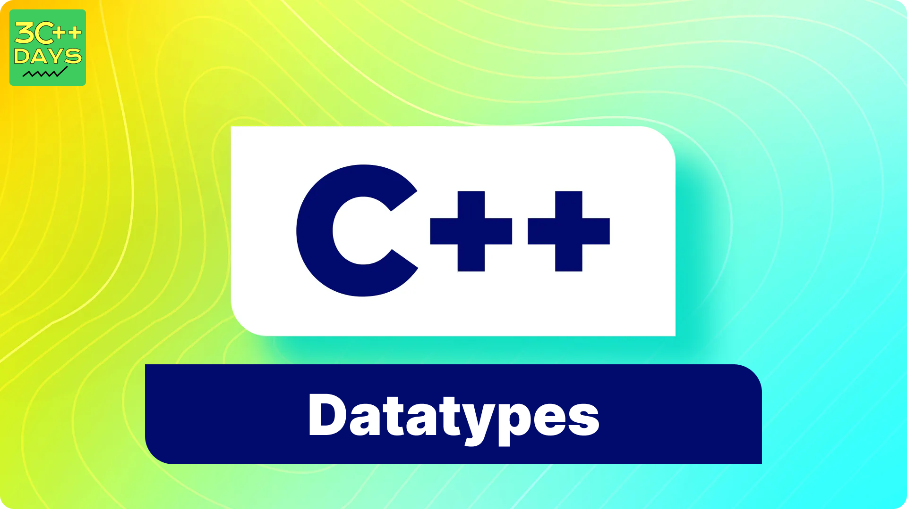

### 1. What is Data Types in C++?
All variables use data type during declaration to restrict the type of data to be stored. Therefore, we can say that data types are used to tell the variables the type of data they can store. Whenever a variable is defined in C++, the compiler allocates some memory for that variable based on the data type with which it is declared. Every data type requires a different amount of memory. 
#### C++ supports the following data types:

1. Primary or Built-in or Fundamental data type
2. Derived data types
3. User-defined data types



### 2. C++ Fundamental Data Types
 These data types are built-in or predefined data types and can be used directly by the user to declare variables. example: int, char, float, bool, etc. Fundamental data types available in C++ are: 

- Integer
- Character
- Boolean
- Floating Point
- Double Floating Point
- Valueless or Void
- Wide Character
### 3. Examples of Data Types in C++
- Integer: The keyword used for integer data types is ``int``. Integers typically require 4 bytes of memory space and range from -2147483648 to 2147483647.  
- Character: Character data type is used for storing characters. The keyword used for the character data type is ``char``. Characters typically require 1 byte of memory space and range from -128 to 127 or 0 to 255.  
- Boolean: Boolean data type is used for storing Boolean or logical values. A Boolean variable can store either `true` or `false`. The keyword used for the Boolean data type is ``bool``. 
- Floating Point: Floating Point data type is used for storing single-precision floating-point values or decimal values. The keyword used for the floating-point data type is ``float``. Float variables typically require 4 bytes of memory space. 
- Double Floating Point: Double Floating Point data type is used for storing double-precision floating-point values or decimal values. The keyword used for the double floating-point data type is ``double``. Double variables typically require 8 bytes of memory space. 
- void: Void means without any value. void data type represents a valueless entity. A ``void`` data type is used for those function which does not return a value. 
- Wide Character: Wide character data type is also a character data type but this data type has a size greater than the normal 8-bit data type. Represented by ``wchar_t``. It is generally 2 or 4 bytes long.
- sizeof() operator: ``sizeof()`` operator is used to find the number of bytes occupied by a variable/data type in computer memory.
### 4. C++ Modified Data Types List
1. Enumerations (enum):
Enumerations allow you to define a set of named integer constants.
```cpp
Example:

enum Color { RED, GREEN, BLUE };
```

2. Structures (struct):
Structures allow you to group related variables of different data types into a single unit.
```cpp
Example:

struct Point {
    int x;
    int y;
};
```

3. Unions (union):
Unions allow you to store different data types in the same memory location.
Only one member of the union can be accessed at a time.
```cpp
Example:

union Data {
    int i;
    float f;
    char c;
};
```

4. Classes (class):
Classes are used for object-oriented programming.
They encapsulate data (attributes) and methods (functions) into a single unit.
```cpp
Example:

class Circle {
    double radius;
public:
    double getArea() { return 3.14 * radius * radius; }
};
```

5. Arrays:
Arrays allow you to store multiple elements of the same data type in a contiguous memory block.
```cpp
Example:

int scores[5] = { 90, 85, 78, 92, 88 };
```
### 5. Derived Data Types in C++
 Derived data types that are derived from the primitive or built-in datatypes are referred to as Derived Data Types. These can be of four types namely: 

1. Function:
A function is a block of code or program segment that performs a specific well-defined task.
Functions allow you to encapsulate a set of instructions and reuse them.
```cpp
Example:

int max(int x, int y) {
    return (x > y) ? x : y;
}
```

2. Array:
An array is a collection of elements of the same data type stored in contiguous memory locations.
It allows you to represent many instances of a value in a single variable.
```cpp
Example:

int scores[5] = { 90, 85, 78, 92, 88 };
```

3. Pointers:
Pointers are symbolic representations of memory addresses.
They allow programs to simulate call-by-reference and create dynamic data structures.
```cpp
Example:

int num = 42;
int* ptr = &num;
```

4. References:
References provide an alias for an existing variable.
They allow you to work with the original variable directly.
```cpp
Example:

int original = 100;
int& ref = original;
```
