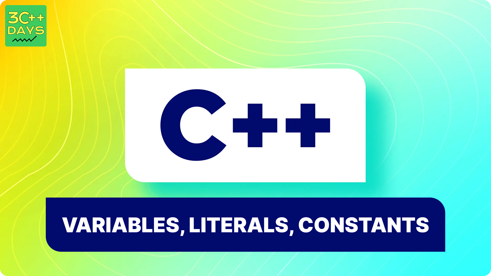

import BackToTop from '@site/src/components/BackToTop/BackToTop';

### 1. What is Variables, Literals, and Constants in C++?
#### Variables
- A variable is a container (storage area) used to hold data.
- Each variable is given a unique name (identifier) to indicate its storage area.
```cpp
For example:
int age = 14; // 'age' is a variable of the int data type
age = 17;     // Now 'age' is 17
```
- Variables allow us to store and manipulate data during program execution.
#### Constants:
- A constant is a value that cannot be changed once it has been defined.
- Constants are treated like regular variables, but their values remain fixed.
- We use the const keyword to declare constants.
```cpp
Example:
const int LIGHT_SPEED = 299792458; // LIGHT_SPEED is a constant
// Attempting to change LIGHT_SPEED will result in an error
``` 

- Constants ensure that specific, unchanging values are used throughout the program.
#### Literals:
- Literals are fixed values used directly in the code.
- They represent specific data without any variables or calculations.
```cpp
Examples of literals:
Integer literals: 9, 42, -5
Floating-point literals: 3.14, -0.005
Character literals: 'A', 'b', '1'
String literals: "Hello, World!", "C++ is fun"
```
- Literals cannot be assigned different values; they remain constant.
### 2. Why do we use Variables, Literals, and Constants in C++?
1. Variables:
- Allow us to store and manipulate data dynamically during program execution.
- Enable flexibility and adaptability in our code.
- Improve readability by giving meaningful names to data.
2. Constants:
- Ensure specific values remain fixed throughout the program.
- Enhance code clarity by using descriptive names for important values.
- Prevent accidental modification of critical data.
3. Literals:
- Provide fixed values directly in the code.
- Improve code readability by eliminating magic numbers.
- Represent specific data without the need for variables.
### 3. Write a simple program to demonstrate the use of Variables, Literals, and Constants in C++.
```c++
#include <iostream>
using namespace std;

int main() {
    // Variables
    int age = 25;
    double pi = 3.14;
    char grade = 'A';

    // Constants
    const int LIGHT_SPEED = 299792458;

    // Literals
    int num1 = 42; // Integer literal
    double num2 = 2.71828; // Floating-point literal
    char letter = 'X'; // Character literal
    string message = "Hello, World!"; // String literal

    // Display values
    cout << "Age: " << age << endl;
    cout << "Pi: " << pi << endl;
    cout << "Grade: " << grade << endl;
    cout << "Speed of light: " << LIGHT_SPEED << " m/s" << endl;
    cout << "Integer literal: " << num1 << endl;
    cout << "Floating-point literal: " << num2 << endl;
    cout << "Character literal: " << letter << endl;
    cout << "String literal: " << message << endl;

    return 0;
}
```


### 4. Types of Variables in C++
i. Local Variables:
- Local variables are declared within a function or a block of code.
- They have local scope, meaning they are accessible only within the function or block where they are defined.
- Local variables are created when the function or block is entered and destroyed when it exits.
```c++
Example:
void myFunction() {
    int localVar = 42; // Local variable
    // ...
}
```
ii. Global Variables:
- Global variables are declared outside any function or block.
- They have global scope, meaning they can be accessed from any part of the program.
- Global variables exist throughout the program’s execution.
```c++
Example:
int globalVar = 100; // Global variable

void myFunction() {
    // Access globalVar here
    // ...
}
```
iii. Static Variables:
- Static variables are local variables with a special property.
- They retain their value between function calls.
- Static variables are initialized only once, even if the function is called multiple times.
```c++
Example:
void myFunction() {
    static int count = 0; // Static variable
    count++;
    // ...
}
```

iv. Register Variables:
- Register variables are used to request the compiler to store the variable in a CPU register for faster access.
- The register keyword hints the compiler to optimize access to this variable.
- Note that the compiler may ignore the request if it deems it unnecessary.
```c++
Example:
register int speed = 100; // Register variable
```
### 5. Types of Literals in C++
Literals are the constant values that are assigned to the variables. Literals represent fixed values that cannot be modified. Literals contain memory but they do not have references as variables. Generally, both terms, constants, and literals are used interchangeably. 
For example, “const int = 5;“, is a constant expression and the value 5 is referred to as a constant integer literal.
i. Integer Literals:
- Integer literals represent whole numbers without any fractional part.
- They can be positive or negative.
```c++
Examples:
Decimal Integer: 42, -123
Octal Integer: 012, 077
Hexadecimal Integer: 0xff, 0x2a
Binary Integer (Java SE 7 and above): 0b1010101
```
ii. Floating Point Literals:
- Floating-point literals represent decimal numbers with a fractional part.
- They can be either single-precision (float) or double-precision (double).
```c++
Examples:
3.14, -0.005, 2.71828
```
iii. Character Literals:
-Character literals represent single characters enclosed in single quotes.
```c++
Examples:
'A', 'b', '1'
```
iv. String Literals:
-String literals represent sequences of characters enclosed in double quotes.
```c++
Example:
"Hello, World!"
```
v. Boolean Literals:
- Boolean literals represent the truth values true or false.
```c++
Example:
true, false
```
vi. Pointer Literals:
Pointer literals are memory addresses represented as hexadecimal values.
```c++
Example:
nullptr (represents a null pointer)
```
### 6. Types of Constants in C++
i. Integer Constants:
- Integer constants represent whole numbers without any fractional part.
- They can be positive or negative.
```c++
Examples:
Decimal Integer: 42, -123
Octal Integer: 012, 077
Hexadecimal Integer: 0xff, 0x2a
Binary Integer (since C23): 0b1010101
```
ii. Floating Point Constants:
- Floating-point constants represent decimal numbers with a fractional part.
- They can be either single-precision (float) or double-precision (double).
```c++
Examples:
3.14, -0.005, 2.71828
```
iii. Character Constants:
Character constants represent single characters enclosed in single quotes.
```c++
Examples:
'A', 'b', '1'
```
iv. String Constants:
- String constants represent sequences of characters enclosed in double quotes.
```c++
Example:
"Hello, World!"
```
v. Boolean Constants:
- Boolean constants represent the truth values true or false.
```c++
Example:
true, false
```
vi. Pointer Constants:
- Pointer constants are memory addresses represented as hexadecimal values.
```c++
Example:
nullptr (represents a null pointer)
```
   
<BackToTop />
