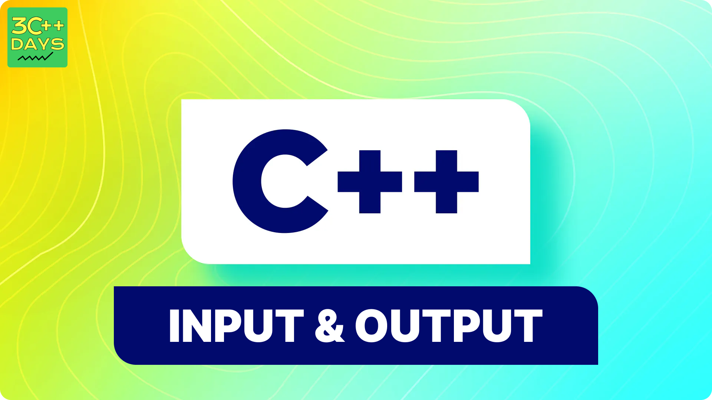

TASK:

1. What is Input and Output in C++?
2. Why do we use Input and Output in C++?
3. How to take input from the user in C++?
4. How to display output to the user in C++?
5. Take Multiple Inputs from the User in C++.

IMAGE FILE:
