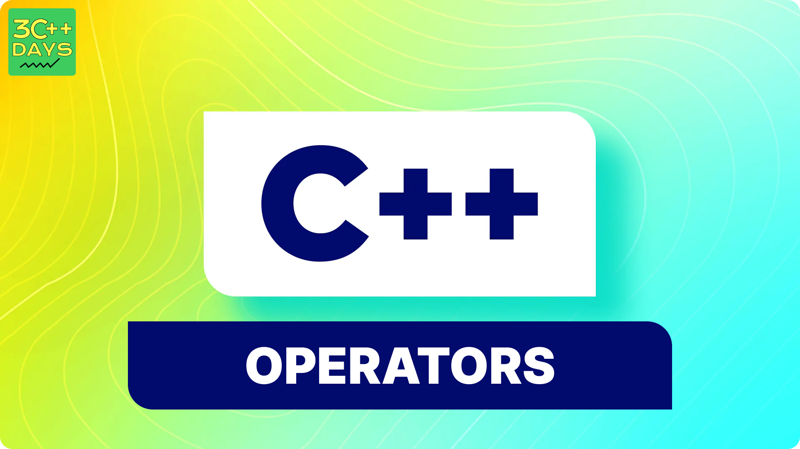

## 1. What is Operators in C++?

In programming, an operator is a symbol that operates on a value or a variable. Operators are essential building blocks in C++, allowing you to perform various operations on data, such as arithmetic calculations, comparisons, and logical operations.---



## 2. Types of Operators in C++

Operators in C++ can be broadly categorized into several types:

1. Arithmetic Operators
2. Relational Operators
3. Logical Operators
4. Bitwise Operators
5. Assignment Operators
6. Increment and Decrement Operators
7. Conditional (Ternary) Operator
8. Compound Operators
9. `sizeof` Operator
10. Comma Operator---

## 3. Explain All the Operators in C++ with Proper Examples

### 1. Arithmetic Operators

Arithmetic operators are used to perform basic mathematical operations. Here are the common arithmetic operators in C++:

- **Addition (+)** : Adds two operands.
- **Subtraction (-)** : Subtracts the second operand from the first.
- **Multiplication (\*)** : Multiplies two operands.
- **Division (/)** : Divides the first operand by the second.
- **Modulus (%)** : Returns the remainder of a division operation.

**Example:**

```cpp
#include <iostream>
using namespace std;

int main() {
    int a = 10, b = 3;
    cout << "a + b = " << a + b << endl;  // Output: 13
    cout << "a - b = " << a - b << endl;  // Output: 7
    cout << "a * b = " << a * b << endl;  // Output: 30
    cout << "a / b = " << a / b << endl;  // Output: 3
    cout << "a % b = " << a % b << endl;  // Output: 1
    return 0;
}
```

### 2. Relational Operators

Relational operators are used to compare two values. They return a boolean result (`true` or `false`).

- **Equal to (==)** : Returns `true` if both operands are equal.
- **Not equal to (!=)** : Returns `true` if operands are not equal.
- **Greater than (>)** : Returns `true` if the first operand is greater than the second.
- **Less than ({'<'})** : Returns `true` if the first operand is less than the second.
- **Greater than or equal to (>=)** : Returns `true` if the first operand is greater than or equal to the second.
- **Less than or equal to ({'<'}=)** : Returns `true` if the first operand is less than or equal to the second.

**Example:**

```cpp
#include <iostream>
using namespace std;

int main() {
    int a = 10, b = 20;
    cout << (a == b) << endl;  // Output: 0 (false)
    cout << (a != b) << endl;  // Output: 1 (true)
    cout << (a > b) << endl;   // Output: 0 (false)
    cout << (a < b) << endl;   // Output: 1 (true)
    cout << (a >= b) << endl;  // Output: 0 (false)
    cout << (a <= b) << endl;  // Output: 1 (true)
    return 0;
}
```

### 3. Logical Operators

Logical operators are used to perform logical operations, often with boolean values.

- **Logical AND (&&)** : Returns `true` if both operands are true.
- **Logical OR (||)** : Returns `true` if at least one of the operands is true.
- **Logical NOT (!)** : Returns `true` if the operand is false, and `false` if the operand is true.

**Example:**

```cpp
#include <iostream>
using namespace std;

int main() {
    bool a = true, b = false;
    cout << (a && b) << endl;  // Output: 0 (false)
    cout << (a || b) << endl;  // Output: 1 (true)
    cout << (!a) << endl;      // Output: 0 (false)
    cout << (!b) << endl;      // Output: 1 (true)
    return 0;
}
```

### 4. Bitwise Operators

Bitwise operators perform bit-by-bit operations on integer data types.

- **AND (&)** : Performs a bitwise AND operation.
- **OR (|)** : Performs a bitwise OR operation.
- **XOR (^)** : Performs a bitwise XOR operation.
- **NOT (~)** : Performs a bitwise NOT operation.
- **Left shift ({'<'}{'<'})** : Shifts bits to the left.
- **Right shift (>>)** : Shifts bits to the right.

**Example:**

```cpp
#include <iostream>
using namespace std;

int main() {
    int a = 5;      // 0101 in binary
    int b = 3;      // 0011 in binary
    cout << (a & b) << endl;  // Output: 1 (0001 in binary)
    cout << (a | b) << endl;  // Output: 7 (0111 in binary)
    cout << (a ^ b) << endl;  // Output: 6 (0110 in binary)
    cout << (~a) << endl;     // Output: -6 (Two's complement of 0101)
    cout << (a << 1) << endl; // Output: 10 (1010 in binary)
    cout << (a >> 1) << endl; // Output: 2 (0010 in binary)
    return 0;
}
```

### 5. Assignment Operators

Assignment operators are used to assign values to variables. Here are some commonly used assignment operators:

- **Assign (=)** : Assigns the right operand to the left operand.
- **Add and assign (+=)** : Adds the right operand to the left operand and assigns the result to the left operand.
- **Subtract and assign (-=)** : Subtracts the right operand from the left operand and assigns the result to the left operand.
- **Multiply and assign (\*=)** : Multiplies the right operand with the left operand and assigns the result to the left operand.
- **Divide and assign (/=)** : Divides the left operand by the right operand and assigns the result to the left operand.
- **Modulus and assign (%=)** : Computes the modulus using the two operands and assigns the result to the left operand.

**Example:**

```cpp
#include <iostream>
using namespace std;

int main() {
    int a = 10;
    a += 5;  // Equivalent to a = a + 5
    cout << a << endl;  // Output: 15
    a -= 3;  // Equivalent to a = a - 3
    cout << a << endl;  // Output: 12
    a *= 2;  // Equivalent to a = a * 2
    cout << a << endl;  // Output: 24
    a /= 4;  // Equivalent to a = a / 4
    cout << a << endl;  // Output: 6
    a %= 5;  // Equivalent to a = a % 5
    cout << a << endl;  // Output: 1
    return 0;
}
```

### 6. Increment and Decrement Operators

Increment and decrement operators are used to increase or decrease the value of a variable by one.

- **Increment (++)** : Increases the value of a variable by one.
- **Decrement (--)** : Decreases the value of a variable by one.

**Example:**

```cpp
#include <iostream>
using namespace std;

int main() {
    int a = 10;
    cout << "a = " << a << endl;   // Output: a = 10
    a++;
    cout << "a++ = " << a << endl; // Output: a++ = 11
    a--;
    cout << "a-- = " << a << endl; // Output: a-- = 10
    return 0;
}
```

### 7. Conditional (Ternary) Operator

The conditional operator (?:) is a shorthand for an `if-else` statement. It takes three operands.

**Syntax:**

```css
condition ? expression1 : expression2;
```

If the condition is true, it evaluates `expression1`; otherwise, it evaluates `expression2`.

**Example:**

```cpp
#include <iostream>
using namespace std;

int main() {
    int a = 10, b = 20;
    int max = (a > b) ? a : b;
    cout << "The maximum value is " << max << endl;  // Output: The maximum value is 20
    return 0;
}
```

### 8. Compound Operators

Compound operators combine an arithmetic operator with an assignment operator.

- **Add and assign (+=)**
- **Subtract and assign (-=)**
- **Multiply and assign (\*=)**
- **Divide and assign (/=)**
- **Modulus and assign (%=)**

These operators have already been covered under assignment operators.

### 9. `sizeof` Operator

The `sizeof` operator is used to determine the size of a data type or a variable in bytes.

**Example:**

```cpp
#include <iostream>
using namespace std;

int main() {
    cout << "Size of int: " << sizeof(int) << " bytes" << endl;       // Output: 4 bytes
    cout << "Size of double: " << sizeof(double) << " bytes" << endl; // Output: 8 bytes
    int a;
    cout << "Size of variable a: " << sizeof(a) << " bytes" << endl;  // Output: 4 bytes
    return 0;
}
```

### 10. Comma Operator

The comma operator (,) is used to separate two or more expressions. The expressions are evaluated from left to right, and the value of the rightmost expression is the result.

**Example:**

```cpp
#include <iostream>
using namespace std;

int main() {
    int a, b;
    a = (b = 3, b + 2);
    cout << "a = " << a << endl;  // Output: a = 5
    return 0;
}
```
## 4. Operator Overloading

### Introduction 

Operator overloading allows you to redefine the way operators work for user-defined types (classes and structs). It enables you to specify more intuitive ways to perform operations on objects of your classes.

Overloading an operator does not change:
- the operator precedence,
- the associativity of the operator,
- the meaning of how the operator works on objects of
built-in types.

### Syntax
An overloaded operator is implemented as a special member function with the keyword `operator` followed by the symbol of the operator being overloaded.

```cpp
class ClassName {
public:
    ReturnType operatorOpSymbol (ParameterList) {
        // Function body
    }
};
```

### Example
```cpp
class Complex {
public:
    double real, imag;

    Complex(double r = 0, double i = 0) : real(r), imag(i) {}

    // Overload the + operator
    Complex operator+ (const Complex& obj) {
        return Complex(real + obj.real, imag + obj.imag);
    }
};
```

### Types of Operators that Can Be Overloaded

- Arithmetic operators: `+`, `-`, `*`, `/`, `%`
- Relational operators: `==`, `!=`, `<`, `>`, `<=`, `>=`
- Logical operators: `&&`, `||`, `!`
- Bitwise operators: `&`, `|`, `^`, `~`, `<<`, `>>`
- Increment and decrement operators: `++`, `--`
- Assignment operators: `=`, `+=`, `-=`, `*=`, `/=`, `%=`
- Subscript operator: `[]`
- Function call operator: `()`
- Member access operators: `->`, `.` (only for pointers to members)
- Input and output operators: `>>`, `<<`

Operators that **cannot** be overloaded include: `::`, `.*`, `.`, `? :`, `sizeof`

Example:
```cpp
#include <iostream>

class Complex {
public:
    double real, imag;

    Complex(double r = 0, double i = 0) : real(r), imag(i) {}

    // Overload the == operator
    bool operator== (const Complex& obj) const {
        return (real == obj.real && imag == obj.imag);
    }
};

int main() {
    Complex c1(3.0, 4.0), c2(3.0, 4.0);
    if (c1 == c2) {
        std::cout << "c1 and c2 are equal" << std::endl;
    } else {
        std::cout << "c1 and c2 are not equal" << std::endl;
    }
    return 0;
}
```
