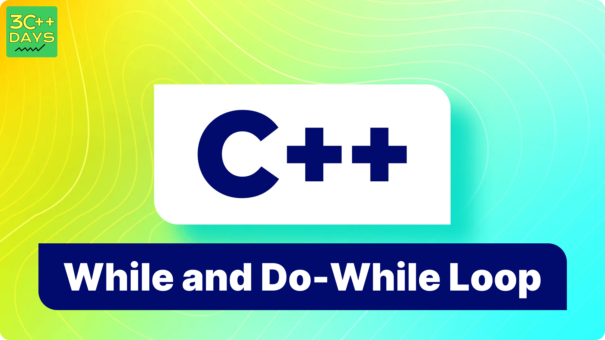

TASK:

1. C++ while and do...while Loop
2. C++ while Loop
3. Flowchart of while Loop
4. Example 1: Display Numbers from 1 to 5
5. C++ do...while Loop
6. Flowchart of do...while Loop
7. Example 2: Display Numbers from 1 to 5

IMAGE FILE:

