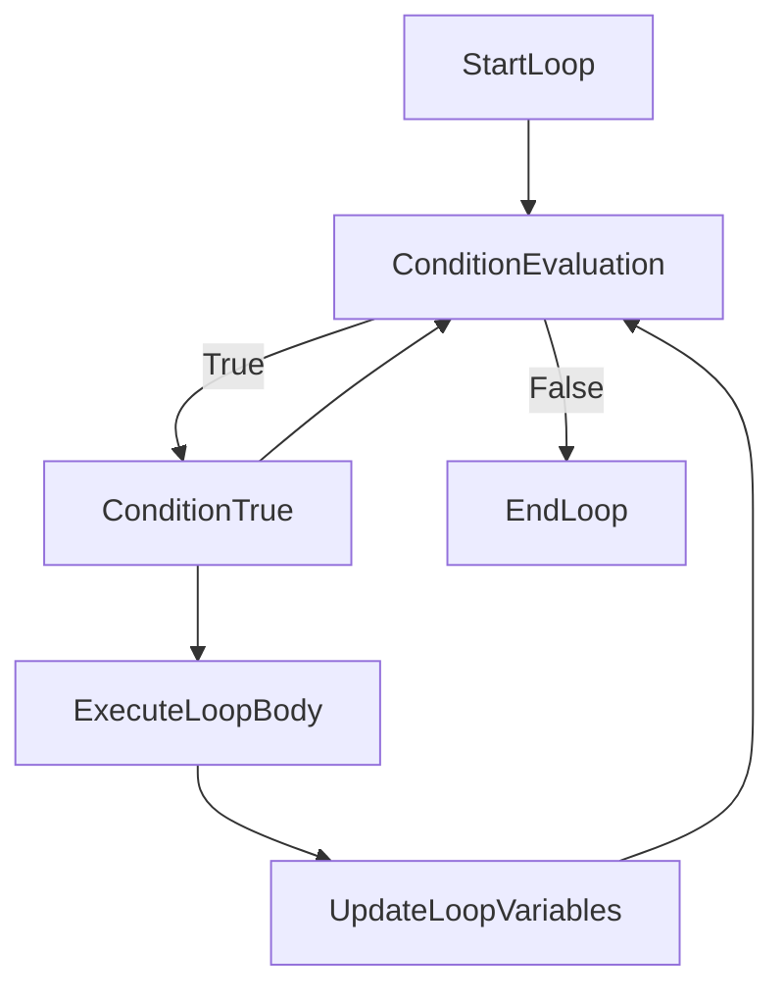
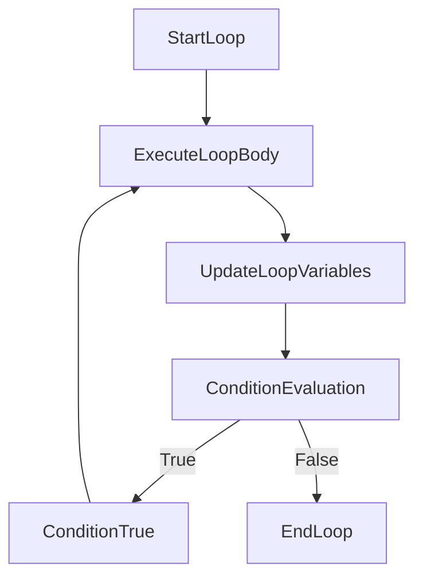

IMAGE FILE:


# 1. C++ while and do...while Loop

In C++, `while` and `do-while loops` are control flow constructs used for repetitive execution of a block of code.

In a `while` loop, the condition is checked before the loop body executes. In contrast, in a do-while loop, the condition is checked after the loop body executes.

A `do-while` loop guarantees that the loop body is executed at least once, while a while loop may not execute at all if the initial condition is false.


# 2. C++ while Loop

The `while` loop repeatedly executes a target statement as long as a given condition is true. Its syntax is as follows:
```cpp
while (condition) {
    // statement(s) to be executed as long as the condition is true
}
```

# 3. Flowchart of while Loop




**Explanation:**

- The loop begins with the "StartLoop" block.
- The condition is evaluated at the "ConditionEvaluation" block. If the condition is false, the loop terminates, and control passes to the "EndLoop" block.
- If the condition is true, the loop body is executed, as indicated by the "ExecuteLoopBody" block.
- After executing the loop body, any necessary variable updates are performed (e.g., incrementing a counter).
- Control then returns to the "ConditionEvaluation" block, where the condition is checked again.
- This process continues until the condition becomes false, at which point the loop terminates, and control passes to the "EndLoop" block.

This flowchart represents the basic structure of a `while` loop and illustrates how the loop iterates as long as the condition remains true.
 
# 4. Example 1: Display Numbers from 1 to 5

```cpp
#include <iostream>

int main() {
    int num = 1;

    while (num <= 5) {
        std::cout << num << " ";
        num++;
    }

    return 0;
}
```

# 5. C++ do...while Loop

The `do-while` loop is similar to the while loop, but with one crucial difference: the condition is evaluated after the loop body executes, ensuring that the loop body is executed at least once. Its syntax is as follows:

```cpp
do {
    // statement(s) to be executed
} while (condition);
```


# 6. Flowchart of do...while Loop




**Explanation:**

- The loop begins with the "StartLoop" block.
- The loop body is executed first at the "ExecuteLoopBody" block.
- After executing the loop body, any necessary variable updates are performed (e.g., incrementing a counter) at the "UpdateLoopVariables" block.
- Control then proceeds to the "ConditionEvaluation" block, where the condition is checked.
- If the condition is true, control returns to the "ExecuteLoopBody" block, and the loop body is executed again.
- This process continues until the condition becomes false, at which point the loop terminates, and control passes to the "EndLoop" block.

This flowchart represents the structure of a `do-while` loop, where the loop body is executed at least once before checking the loop condition.


# 7. Example 2: Display Numbers from 1 to 5

```cpp
#include <iostream>

int main() {
    int num = 1;

    do {
        std::cout << num << " ";
        num++;
    } while (num <= 5);

    return 0;
}
```

