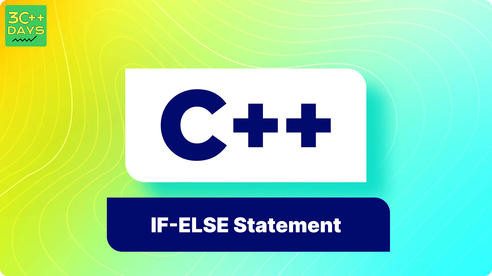

import BackToTop from '@site/src/components/BackToTop/BackToTop';

## 1. What is Control Statements in C++?
Control statements are the keywords and judgement makers of C++, which controls the run time process of a program. These statements enable the program to decide on a course of action, to compute repetitive tasks and to determine the program’s flow according to specific conditions that may have been defined in the statements. There are two primary types of control statements in C++: 
 - Conditionals
 - Loops

**Conditional Statements**
Conditional Statements are block of statements used to execute code based on a certain condition.
There are two types: `if-else` and `Switch` statements.

**Loop Statements**
Loop statements are used to repeat certain task or a block of code.
Types are: `for`, `while` and `do-while` Loops.





## 2. What is the IF-ELSE Statement in C++?
The IF-ELSE statement in C++ is a conditional statement that executes different code blocks based on whether a given condition is `true` or `false`. This is a fundamental concept in programming that allows for decision-making and branching in the code.

### Syntax

```cpp
if (condition) {
    // Code to execute if condition is true
} else {
    // Code to execute if condition is false
}
```

## 3. C++ if Statement
The simplest form of the conditional statement that executes a block of code if the condition is `true`.

### Example
```cpp
#include<iostream>
using namespace std;

int main(){
    int x = 10;

    if(x > 5){
        cout<<"the number is greater than 5"<<endl;
    }
}
```
## 4. C++ if-else Statement
An extension of the if statement that includes an else block to execute code if the condition is `false`.

### Example
```cpp
#include<iostream>
using namespace std;

int main(){
    int x = 10;

    if (x > 15) {
        cout << "x is greater than 15";
    } else {
        cout << "x is not greater than 15";
    }
}
```

## 5. C++ Nested if-else Statement
You can also nest if-else statements inside another if or else block to create more complex conditions.

### Example
```cpp
#include<iostream>
using namespace std;

int main(){
    int x = 10;
    int y = 20;
    if (x > 5) {
        if (y > 15) {
            cout << "x is greater than 5 and y is greater than 15";
        } else {
            cout << "x is greater than 5 but y is not greater than 15";
        }
    } else {
        cout << "x is not greater than 5";
    }
}
```
## 6. C++ if-else-if Ladder
This is used when you have multiple conditions to evaluate. Each condition is checked in sequence, and the block of code for the first true condition is executed.

### Example
```cpp
#include<iostream>
using namespace std;

int main(){
    int x = 10;
    if (x == 10) {
        cout << "x is 10";
    } else if (x == 20) {
        cout << "x is 20";
    } else if (x == 30) {
        cout << "x is 30";
    } else {
        cout << "x is not 10, 20, or 30";
    }
}

```
## 7. C++ Ternary Operator
The ternary operator is a shorthand way to write simple if-else statements. It is also known as the conditional operator.

### Example
```cpp
#include<iostream>
using namespace std;

int main(){
    int x = 10;
    string result = (x > 5) ? "x is greater than 5" : "x is not greater than 5";
    cout << result;
}
```
NOTE:
> In the above code "?" refers to if-statement and statement after the ":" is executed if the if-statement is `false`.

<BackToTop />