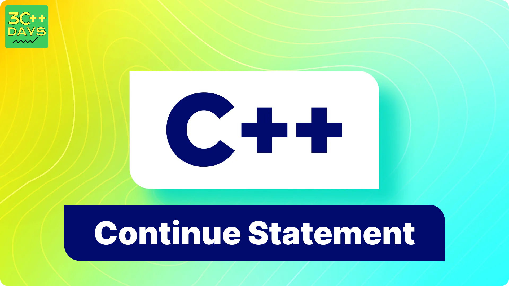

## What is the Continue Statement in C++?
In C++, the continue statement is used within loops to skip the rest of the current iteration and proceed directly to the next iteration of the loop. It's often used to avoid executing certain code in a loop under certain conditions.


### Example

```cpp
    #include <iostream>
    using namespace std;
    int main() {
        for (int i = 1; i <= 5; ++i) {
            if (i == 3) {
            // Skip the rest of the iteration if i equals 3
                continue;
            }
        cout << "Current value of i: " << i <<endl;
    }
    return 0;
}

```




##  Working of C++ continue Statement.

The continue statement in C++ works by interrupting the current iteration of a loop and immediately jumping to the next iteration of the loop. When the continue statement is encountered within a loop, the rest of the code inside the loop's body for the current iteration is skipped, and the loop proceeds with the next iteration.

### Steps: 
1. The loop condition is evaluated.
2. If the loop condition is true, the code inside the loop's body is executed.
3. When the continue statement is encountered, the control immediately jumps to the next iteration of the loop, bypassing the remaining code      inside the loop's body for the current iteration.
4. The loop condition is evaluated again, and the process continues until the loop condition becomes false or another control statement interrupts the loop.


## Example of Continue Statement in C++ with different loops.

### for loop

```cpp

   #include <iostream>
   int main() {
    for (int i = 1; i <= 5; ++i) {
        if (i == 3) {
            // Skip the rest of the iteration if i equals 3
            continue;
        }
        std::cout << "Current value of i: " << i << std::endl;
    }
    return 0;
}

```
### while loop

```cpp

#include <iostream>

int main() {
    int i = 1;
    while (i <= 5) {
        if (i == 3) {
            // Skip the rest of the iteration if i equals 3
            ++i;
            continue;
        }
        std::cout << "Current value of i: " << i << std::endl;
        ++i;
    }
    return 0;
}

```
### do-while loop

```cpp

#include <iostream>

int main() {
    int i = 1;
    do {
        if (i == 3) {
            // Skip the rest of the iteration if i equals 3
            ++i;
            continue;
        }
        std::cout << "Current value of i: " << i << std::endl;
        ++i;
    } while (i <= 5);
    return 0;
}

```
