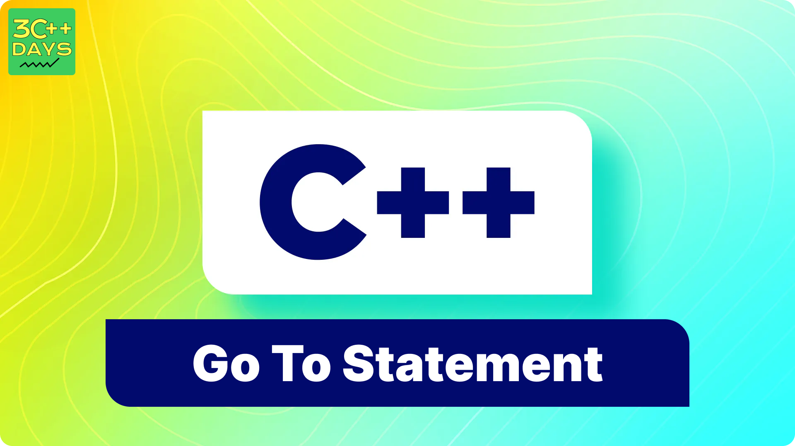

IMAGE FILE:



# 1. What is the Go To Statement in C++?

In C++, the `go to` statement is a control flow statement that allows the program execution to jump to another part of the code unconditionally. It's often discouraged and considered bad practice because it can make code difficult to read and understand, leading to spaghetti code and potential bugs. Instead, structured programming constructs like loops, conditionals, and functions are preferred for better code organization and maintainability.

# 2. Explain the Syntax of Go To Statement in C++.

```cpp
goto label;
```

Where `label` is an identifier followed by a colon (`:`) that marks a specific point in the code. 

# 3. C++ Go To Statement Example

```cpp
#include <iostream>

int main() {
    int x = 5;

    if (x == 5) {
        goto my_label;
    }

    std::cout << "This will not be printed if x is 5.\n";

my_label:
    std::cout << "This will be printed if x is 5.\n";

    return 0;
}
```


# 4. Why is the Go To Statement Considered Harmful?


- Unstructured Code: "Go to" statements can lead to unstructured, spaghetti-like code. Programs with excessive "go to" statements become hard to read, understand, and maintain. Debugging such code can be a nightmare.

- Difficulty in Control Flow Analysis: It becomes difficult to analyze and reason about the flow of control in programs that heavily use "go to" statements. This makes it harder to verify correctness and ensure robustness.

- Code Obfuscation: "Go to" statements can obscure the logical flow of a program, making it challenging for other programmers (including your future self) to comprehend the code's intent and functionality.

- Scope for Bugs and Errors: Misuse of "go to" statements can lead to subtle bugs and errors that are hard to detect and fix. It's easy to accidentally jump to the wrong part of the code or introduce unintended behavior.

- Structured Programming Principles: The widespread adoption of structured programming principles advocates for the use of structured control flow constructs like loops, conditionals, and functions, which offer clearer program organization and better readability.

 - Portability and Maintainability: Code with "go to" statements can be less portable and harder to maintain. Modifying or extending such code becomes risky and error-prone.

# 5. When to Use Go To Statement in C++?

1. Breaking out of Nested Loops: Sometimes, you may encounter a situation where breaking out of nested loops using a "go to" statement could result in cleaner code than using nested break statements.

2. Error Handling in Resource Cleanup: In scenarios where you need to perform resource cleanup (like closing files or releasing memory) when an error occurs, using a "go to" statement to jump to a common cleanup section can help avoid code duplication and ensure proper cleanup.

3. Jumping within a Local Scope: Occasionally, in very specific algorithms or low-level code, jumping within a local scope using "go to" might provide a cleaner and more efficient solution compared to alternative approaches. However, this should be approached with caution and well-documented.

4. Optimization in Performance-Critical Code: In rare cases where performance is critical and careful optimization is necessary, judicious use of "go to" might provide some benefits by avoiding unnecessary function calls or loop iterations.
