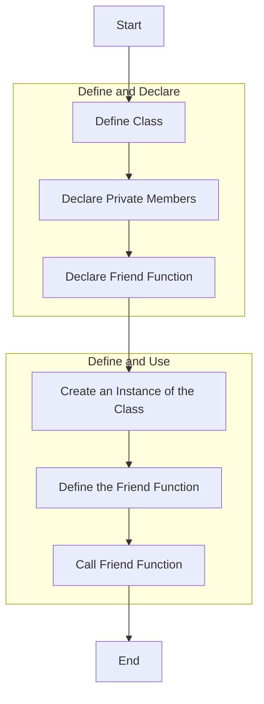
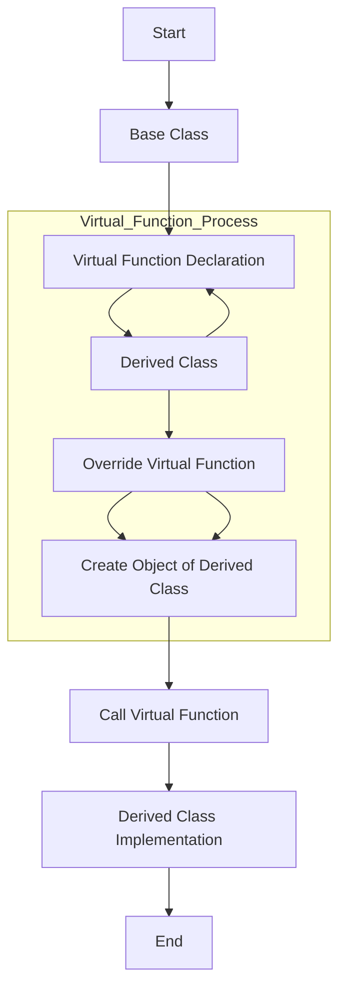

# Friend Functions

A friend function is a function that is not a member of a class but has access to the class's private and protected members. It is declared within the class using the `friend` keyword.

It used in the cases of **Operator Overloading** , accessing **Non-member functions**.

Below is the flowchart for showing work of friend functions.



Example : 

```cpp
#include <iostream>
using namespace std;

class Box {
private:
    double width;

public:
    Box(double w) : width(w) {}

    // Friend function declaration
    friend void printWidth(Box box);
};

// Friend function definition
void printWidth(Box box) {
    cout << "Width of box: " << box.width << endl;
}

int main() {
    Box box(10.0);
    printWidth(box); // Accesses private member of Box
    return 0;
}
```


# Virtual Functions

A virtual function is a member function in a base class that can be overridden in a derived class. It is declared using the `virtual` keyword in the base class and allows dynamic (runtime) polymorphism.

Here is the flowchart which gives idea behind virtual functions.



Example :

```cpp
#include <iostream>
using namespace std;

class Base {
public:
    virtual void display() {
        cout << "Display of Base class" << endl;
    }

    // Pure virtual function (abstract class)
    virtual void pureVirtualFunction() = 0;
};

class Derived : public Base {
public:
    void display() override { // Override the base class function
        cout << "Display of Derived class" << endl;
    }

    void pureVirtualFunction() override {
        cout << "Implementation of pure virtual function in Derived class" << endl;
    }
};

int main() {
    Base* basePtr;
    Derived derivedObj;
    basePtr = &derivedObj;

    basePtr->display(); // Calls Derived's display function
    basePtr->pureVirtualFunction(); // Calls Derived's implementation of pure virtual function

    return 0;
}
```
