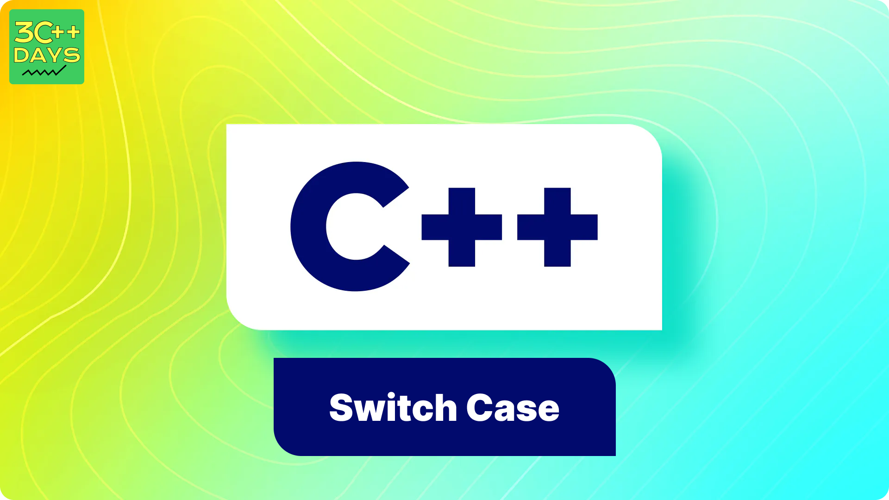

TASK:

1. What is the Switch Case Statement in C++?
2. Explain the Syntax of Switch Case Statement in C++.
3. How does the Switch Case Statement work in C++?
4. C++ Switch Case Statement Example
5. C++ Switch Case Statement with Break

IMAGE FILE:

