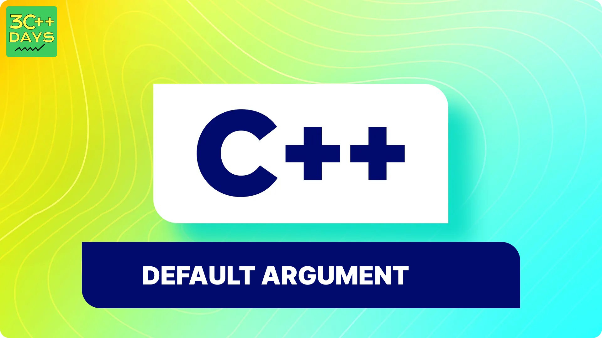

### What is Default Arguments in C++?
Default arguments in C++ allow you to initialize a function parameter with a default value. This means that if the caller of the function doesn't provide a value for that parameter, the default value will be used. Default arguments provide flexibility and convenience in function calls by allowing some parameters to be optional.





### Explain the Syntax of Default Arguments in C++.

```cpp

return_type function_name(type1 parameter1 = default_value1, type2 parameter2 = default_value2, ...);

```
Here, return_type is the type of value the function returns, function_name is the name of the function, type1, type2, etc., are the types of the function parameters, parameter1, parameter2, etc., are the names of the parameters, and default_value1, default_value2, etc., are the default values assigned to the parameters.


### How to Declare and Define a Function with Default Arguments in C++?

```cpp

#include <iostream>
using namespace std;

void printMessage(string message = "Hello, World!") {
    cout << message << endl;
}

```
In this example, the function printMessage is declared with a default argument message set to "Hello, World!". If no argument is provided when calling this function, it will print "Hello, World!".

### C++ Default Arguments Example.

```cpp

#include <iostream>
using namespace std;

void printNumber(int num, int width = 10) {
    cout.width(width);
    cout << num << endl;
}

int main() {
    printNumber(123);    // Output: "       123"
    printNumber(456, 5); // Output: "  456"
    
    return 0;
}

```
