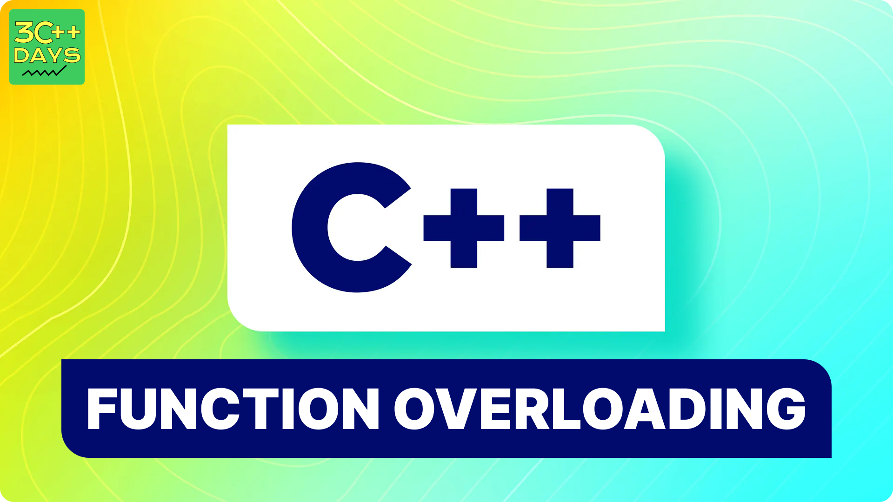

TASK:

1. What is Function Overloading in C++?
2. Explain the Syntax of Function Overloading in C++.
3. How to Declare and Define a Function Overloading in C++?
4. C++ Function Overloading Example

## Function Overloading in C++
Function overloading in C++ is a feature that allows you to define multiple functions with the same name but with different parameter lists within the same scope. The parameter lists can differ in the number of parameters, the types of parameters, or both. The compiler determines which function to call based on the arguments used when the function is invoked.

Here are the key points about function overloading:

1. Same Function Name: All the overloaded functions must have the same name.
2. Different Parameter Lists: The functions must differ in the number and/or type of their parameters. This difference in the parameter list is known as the function's signature.
3. Return Type: The return type of the functions can be different, but the return type alone is not enough to distinguish overloaded functions.

## Syntax of Function Overloading in C++
The syntax of function overloading in C++ involves defining multiple functions with the same name but different parameter lists within the same scope. Here’s how you can do it, along with explanations and examples:

### Basic Syntax

1. **Function Declarations/Definitions**:
   ```cpp
   return_type function_name(parameter_list);
   return_type function_name(parameter_list);
   ```

   - **return_type**: The return type of the function (e.g., `int`, `void`, `double`).
   - **function_name**: The name of the function.
   - **parameter_list**: A list of parameters that differ between overloaded functions.

2. **Function Calls**:
   ```cpp
   function_name(arguments);
   ```

  ## How to Declare and Define a Function Overloading in C++
  Declaring and defining function overloading in C++ involves creating multiple functions with the same name but different parameter lists within the same scope. Here’s a step-by-step guide on how to declare and define overloaded functions.

### Declaration of Overloaded Functions

Function declarations, also known as function prototypes, provide the compiler with information about the function's name, return type, and parameters without giving the function's actual body.

1. **Function Declaration Syntax**:
   ```cpp
   return_type function_name(parameter_list);
   ```

2. **Example of Declarations**:
   ```cpp
   int add(int a, int b);              // Declaration 1
   double add(double a, double b);     // Declaration 2
   int add(int a, int b, int c);       // Declaration 3
   ```

### Definition of Overloaded Functions

Function definitions provide the actual body of the function.

1. **Function Definition Syntax**:
   ```cpp
   return_type function_name(parameter_list) {
       // Function body
   }
   ```

2. **Example of Definitions**:
   ```cpp
   int add(int a, int b) {
       return a + b;
   }

   double add(double a, double b) {
       return a + b;
   }

   int add(int a, int b, int c) {
       return a + b + c;
   }
   ```

### Complete Example with Declarations and Definitions

```cpp
#include <iostream>
using namespace std;

// Declarations
int add(int a, int b);
double add(double a, double b);
int add(int a, int b, int c);

int main() {
    // Calling overloaded functions
    cout << "Sum of 2 and 3: " << add(2, 3) << endl;           // Calls add(int, int)
    cout << "Sum of 2.5 and 3.5: " << add(2.5, 3.5) << endl;   // Calls add(double, double)
    cout << "Sum of 1, 2, and 3: " << add(1, 2, 3) << endl;    // Calls add(int, int, int)
    return 0;
}

// Definitions
int add(int a, int b) {
    return a + b;
}

double add(double a, double b) {
    return a + b;
}

int add(int a, int b, int c) {
    return a + b + c;
}
```

### Explanation

1. **Declarations**:
   - The function prototypes for `add` are declared before `main()`.
   - These prototypes inform the compiler about the existence of these functions and their signatures.

2. **Definitions**:
   - The actual function bodies are defined after `main()`.
   - Each overloaded function performs addition, but they differ in their parameter lists.

3. **Function Calls in `main()`**:
   - `add(2, 3)` calls the first `add` function (`int add(int, int)`).
   - `add(2.5, 3.5)` calls the second `add` function (`double add(double, double)`).
   - `add(1, 2, 3)` calls the third `add` function (`int add(int, int, int)`).

### Summary

To declare and define overloaded functions in C++, you:

1. **Declare** the functions with the same name but different parameter lists.
2. **Define** each function with the same name but different parameter lists.
3. **Call** the appropriate overloaded function based on the arguments provided.

This approach allows you to use the same function name for different tasks based on different input parameters, enhancing code readability and maintainability.

## C++ Function Overloading Example
This example shows how to use function overloading to create multiple functions with the same name but different parameter lists, enhancing code readability and functionality.

### Example: Area Calculation

We will overload a function named `area` to calculate the area of different shapes: a rectangle, a circle, and a triangle.

### Code Example

```cpp
#include <iostream>
#include <cmath> // For M_PI and sqrt
using namespace std;

// Function to calculate the area of a rectangle
double area(double length, double width) {
    return length * width;
}

// Function to calculate the area of a circle
double area(double radius) {
    return M_PI * radius * radius;
}

// Function to calculate the area of a triangle using Heron's formula
double area(double side1, double side2, double side3) {
    double s = (side1 + side2 + side3) / 2; // Semi-perimeter
    return sqrt(s * (s - side1) * (s - side2) * (s - side3));
}

int main() {
    double length = 5.0, width = 3.0;
    double radius = 4.0;
    double side1 = 3.0, side2 = 4.0, side3 = 5.0;

    cout << "Area of rectangle: " << area(length, width) << endl;
    cout << "Area of circle: " << area(radius) << endl;
    cout << "Area of triangle: " << area(side1, side2, side3) << endl;

    return 0;
}
```

### Explanation

1. **Function to Calculate the Area of a Rectangle**:
   ```cpp
   double area(double length, double width) {
       return length * width;
   }
   ```
   - This function takes two parameters: `length` and `width`.
   - It returns the area of the rectangle using the formula \( \text{area} = \text{length} \times \text{width} \).

2. **Function to Calculate the Area of a Circle**:
   ```cpp
   double area(double radius) {
       return M_PI * radius * radius;
   }
   ```
   - This function takes one parameter: `radius`.
   - It returns the area of the circle using the formula \( \text{area} = \pi \times \text{radius}^2 \).
   - `M_PI` is a constant representing the value of π (pi).

3. **Function to Calculate the Area of a Triangle Using Heron's Formula**:
   ```cpp
   double area(double side1, double side2, double side3) {
       double s = (side1 + side2 + side3) / 2; // Semi-perimeter
       return sqrt(s * (s - side1) * (s - side2) * (s - side3));
   }
   ```
   - This function takes three parameters: `side1`, `side2`, and `side3`.
   - It calculates the area of the triangle using Heron's formula:
     - First, it computes the semi-perimeter \( s \).
     - Then, it calculates the area using the formula \( \text{area} = \sqrt{s \times (s - \text{side1}) \times (s - \text{side2}) \times (s - \text{side3})} \).

4. **Main Function**:
   ```cpp
   int main() {
       double length = 5.0, width = 3.0;
       double radius = 4.0;
       double side1 = 3.0, side2 = 4.0, side3 = 5.0;

       cout << "Area of rectangle: " << area(length, width) << endl;
       cout << "Area of circle: " << area(radius) << endl;
       cout << "Area of triangle: " << area(side1, side2, side3) << endl;

       return 0;
   }
   ```
   - The `main` function initializes the dimensions of different shapes.
   - It calls the overloaded `area` functions with appropriate arguments for each shape.
   - It prints the calculated areas of the rectangle, circle, and triangle.

### Output

The program will output the calculated areas for the rectangle, circle, and triangle:

```
Area of rectangle: 15
Area of circle: 50.2655
Area of triangle: 6
```

This example demonstrates how function overloading can be used to create multiple functions with the same name but different parameter lists, allowing you to perform similar operations on different types or numbers of inputs.

### Summary

Function overloading in C++ allows multiple functions with the same name but different parameter lists. This enhances code readability and usability by enabling functions to perform similar tasks with different types or numbers of inputs. The compiler uses the function signature (name + parameter list) to determine which function to call.


IMAGE FILE:


