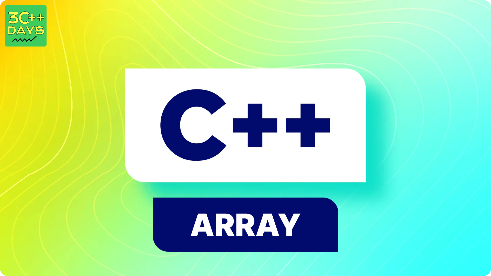

## What is Array in C++?
In C++, an array is a data structure designed to hold multiple values of the **same data type** in a continuous block of memory.

For **instance**, storing the marks of 4 or 5 students can be managed by creating individual variables for each student's marks. However, this approach quickly becomes impractical when you need to store the marks of 100 or even 500 students. Managing such a large number of variables would be cumbersome and error-prone. This is where arrays become extremely useful, as they allow you to create a single array with the required number of elements to store the marks efficiently.




## Syntax of Array in C++
The basic array declaration in C++ is given as:
```cpp
data_type array_name[Size_of_array];
```
Example
```cpp
int arr[10];
```
Here,

- **int**: It is the type of data to be stored in the array. We can also use other data types such as char, float, and double.
- **arr**: It is the name of the array.
- **10**: It is the size of the array which means only 10 elements can be stored in the array.

## Initialisation of Array in C++?
In C++, array can be initialised in many ways. Here, we are going to discuss most common ways. We can initialize an array at the time of declaration or after declaration.

### 1. Initialize Array with Values in C++
We have initialized the array with values.

```cpp
int arr[5] = {1, 2, 3, 4, 5};
```

### 2. Initialize Array with Values and without Size in C++
We initialized the array with values without specifying its length, so the array's length automatically matches the number of elements within the curly braces.
```cpp
int arr[] = {1, 2, 3, 4, 5};
```
### 3. Initialize Array after Declaration (Using Loops)
We have initialized the array using a loop after declaring the array.
```cpp
for (int i = 0; i < N; i++) {
    arr[i] = value;
}
```
### 4. Initialize an array partially in C++
Here, we have declared an array ‘partialArray’ with size ‘5’ and with values ‘1’ and ‘2’ only. So, these values are stored at the first two indices, and at the rest of the indices ‘0’ is stored.
```cpp
int partialArray[5] = {1, 2};

```
### 5. Initialize the array with zero in C++
We can initialize the array with all elements as ‘0’ by specifying ‘0’ inside the curly braces.
```cpp
int zero_array[5] = {0};
```

## Accessing an Element of an Array in C++
Elements of an array can be accessed by specifying the name of the array, then the index of the element enclosed in the array subscript operator []. For example, arr[i].

### C++ Program to Illustrate How to Access Array Elements

```cpp
// C++ Program to Illustrate How to Access Array Elements 
#include <iostream> 
using namespace std; 

int main() 
{ 

	int arr[3]; 

	// Inserting elements in an array 
	arr[0] = 10; 
	arr[1] = 20; 
	arr[2] = 30; 

	// Accessing and printing elements of the array 
	cout << "arr[0]: " << arr[0] << endl; 
	cout << "arr[1]: " << arr[1] << endl; 
	cout << "arr[2]: " << arr[2] << endl; 

	return 0; 
}

```
**Output**

```cpp
arr[0]: 10
arr[1]: 20
arr[2]: 30
```
## Update an Array in C++
To update an array element, use the index within the array subscript operator and assign a new value:

```cpp
arr[i] = new_value;
```
## Traverse an Array in C++
To traverse an array in C++, use a loop with indexing. For example, to print elements of an array `table_of_two` containing multiples of 2, use a for loop from 0 to 9 (since indexing starts at zero):

### C++ Program to Illustrate How to Traverse an Array
```cpp
 
#include <iostream> 
using namespace std; 

int main() 
{ 

	// Initialize the array 
	int table_of_two[10] 
		= { 2, 4, 6, 8, 10, 12, 14, 16, 18, 20 }; 

	// Traverse the array using for loop 
	for (int i = 0; i < 10; i++) { 
		// Print the array elements using indexing 
		cout << table_of_two[i] << " "; 
	} 

	return 0; 
}

```
**Output**

```cpp
2 4 6 8 10 12 14 16 18 20 
```
## Sizeof an Array in C++
In C++, you can calculate the size of an array using the `sizeof` operator. First, find the total size of the array in memory, then divide by the size of one element. This gives the number of elements in the array.

```cpp
data_type size = sizeof(Array_name) / sizeof(Array_name[0]);
```

Example:

```cpp
#include <iostream>

int main() {
    int arr[] = {1, 2, 3, 4, 5};
    int size = sizeof(arr) / sizeof(arr[0]);
    std::cout << "Size of arr[0]: " << arr[0] << std::endl;
    std::cout << "Array size: " << sizeof(arr) << std::endl;
    std::cout << "Array length: " << size << std::endl;
    return 0;
}
```
**Output**

```cpp
Size of arr[0]: 4
Array size: 20
Array length: 5
```
