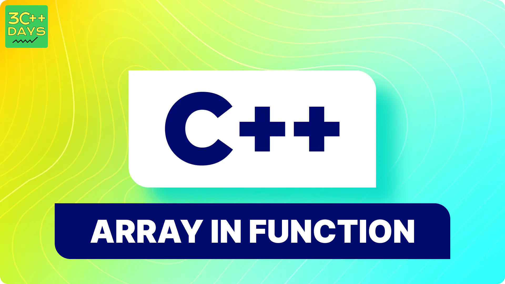

## Arrays in C++ Functions

### 1. What are Arrays in Functions?

In C++, an array within a function is a collection of elements with the same data type, stored contiguously in memory. You can use arrays in functions in two ways:

* **Passing arrays as arguments:** Allow functions to operate on the elements of an existing array.
* **Declaring arrays within functions:** Create temporary arrays for specific function tasks.

### 2. Syntax of Arrays in Functions

**Passing Arrays as Arguments:**

There are three common methods:

* **By pointer:**
   ```c++
   void myFunction(int *myArray, int size); // Function parameter
   ```
* **By sized array (deprecated):**
   ```c++
   void myFunction(int myArray[10]); // Function parameter (deprecated)
   ```
* **By reference (C++11 and later):**
   ```c++
   void myFunction(const int (&myArray)[10]); // Function parameter (C++11+)
   ```

**Declaring Arrays within Functions:**

```c++
void myFunction() {
    int localArray[5]; // Array declared locally within the function
}
```

## 3. How to Declare and Define an Array in Function in C++?

### Declaring an Array in Function

When declaring an array in the function parameter list, you typically just declare it as a pointer, because arrays decay to pointers when passed to functions.

```cpp
void printArray(int arr[], int size);
```

### Defining a Function that Accepts an Array

Here's how you might define a function that takes an array as an argument:

```cpp
void printArray(int arr[], int size) {
    for (int i = 0; i < size; i++) {
        std::cout << arr[i] << " ";
    }
    std::cout << std::endl;
}
```


### 4. C++ Array in Function Example (Passing by Pointer)

```c++
#include <iostream>

void printArray(int *arr, int size) {
    for (int i = 0; i < size; i++) {
        std::cout << arr[i] << " ";
    }
    std::cout << std::endl;
}

int main() {
    int myArray[] = {1, 2, 3, 4, 5};
    int n = sizeof(myArray) / sizeof(myArray[0]); // Get array size
    printArray(myArray, n); // Pass array and its size
    return 0;
}
```

This code defines a `printArray` function that takes an integer pointer and the array size as arguments. It then iterates through the array and prints its elements.

## 5. How to Pass an Array to a Function in C++?

To pass an array to a function in C++, you can simply specify the array name (which decays to a pointer) and optionally the size of the array.

```cpp
#include <iostream>

void processArray(int arr[], int size) {
    // Process array elements
    for (int i = 0; i < size; i++) {
        arr[i] *= 2; // Example processing: double each element
    }
}

int main() {
    int myArray[] = {1, 2, 3, 4, 5};
    int size = sizeof(myArray) / sizeof(myArray[0]);
    processArray(myArray, size);
    
    // Print the processed array
    for (int i = 0; i < size; i++) {
        std::cout << myArray[i] << " ";
    }
    std::cout << std::endl;
    return 0;
}
```

## 6. How to Return an Array from a Function in C++?

In C++, you cannot return arrays directly from functions. Instead, you can return a pointer to an array, or use other data structures like `std::vector` or `std::array` from the C++ Standard Library, which are more flexible and safer.

### Example using a pointer:

```cpp
#include <iostream>

int* createArray(int size) {
    int* arr = new int[size];
    for (int i = 0; i < size; i++) {
        arr[i] = i + 1;
    }
    return arr;
}

int main() {
    int size = 5;
    int* myArray = createArray(size);
    
    for (int i = 0; i < size; i++) {
        std::cout << myArray[i] << " ";
    }
    std::cout << std::endl;

    delete[] myArray; // Don't forget to free the allocated memory
    return 0;
}
```

### Example using `std::vector`:

```cpp
#include <iostream>
#include <vector>

std::vector<int> createVector(int size) {
    std::vector<int> vec(size);
    for (int i = 0; i < size; i++) {
        vec[i] = i + 1;
    }
    return vec;
}

int main() {
    int size = 5;
    std::vector<int> myVector = createVector(size);
    
    for (int i = 0; i < size; i++) {
        std::cout << myVector[i] << " ";
    }
    std::cout << std::endl;
    return 0;
}
```

Using `std::vector` or `std::array` is generally preferred due to better safety, easier memory management, and more features compared to raw arrays.


**Note:** While sized arrays (like `void myFunction(int myArray[10])`) were used in the past, they are generally discouraged due to limitations and potential safety concerns. Prefer using pointers or references for better flexibility and clarity.


IMAGE FILE:

