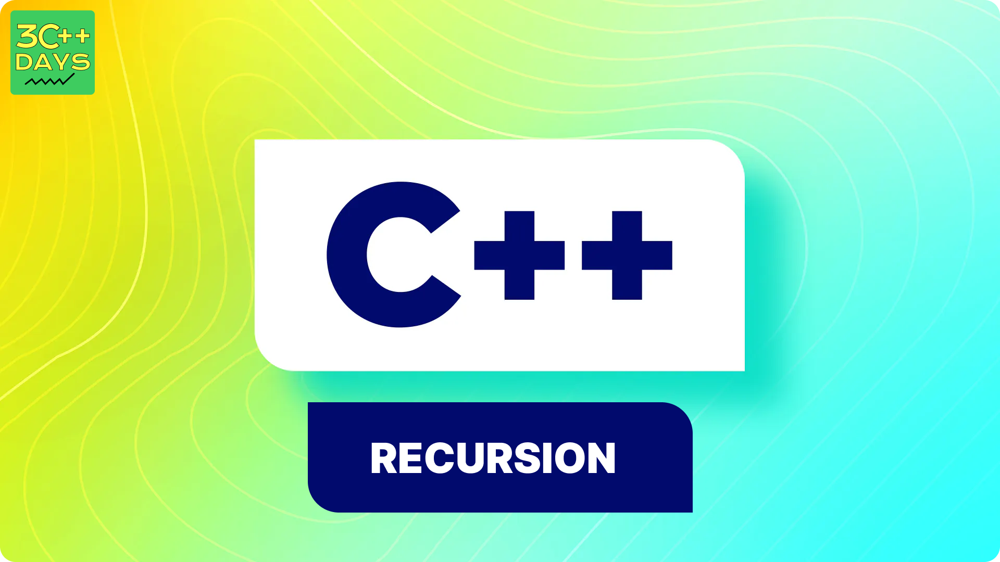

## What is Recursion in C++?
Recursion in C++ is a technique in which a function calls itself repeatedly until a given condition is satisfied. It can be a powerful tool in programming, particularly for tasks that can be divided into smaller, similar sub-tasks.




## Syntax 
```cpp
return_type recursive_func {
    ....
       // Base Condition
       // Recursive Case
       ....
}
```
Explaination :

A recursive function has a base condition that stops further calls by returning a result, and a recursive case that calls the function with smaller sub-problems until the base condition is met.

## Recusive Function
A function that calls itself is called a recursive function. When a recursive function is called, it executes a set of instructions and then calls itself to execute the same set of instructions with a smaller input. 

## How to Declare and Define a Recursive Function in C++?

To declare and define a recursive function in C++, follow these steps:

## Declaration : You need to declare the function prototype at the beginning of your code or before its first use if it’s being called in multiple functions.

## Definition : You then define the function, specifying its behavior, including the base condition and the recursive case.

## Example : Here’s a step-by-step example using a function that calculates the factorial of a number.
```cpp
#include <iostream>

// Declaration
int factorial(int n);

// Definition
int factorial(int n) {
    if (n <= 1) {
        return 1;
    } else {
        return n * factorial(n - 1); // recursive call
    }
}

int main() {
    int number = 5;
    std::cout << "Factorial of " << number << " is " << factorial(number) << std::endl;
    return 0;
}
```
## Output
```cpp
  Factorial of 5 is 125.
```

In this example:

The base condition is if (n <= 1), which returns 1 when n is 0 or 1.
The recursive case is return n * factorial(n - 1), which calls the function itself with n - 1 until it reaches the base condition.


## Advantages of C++ Recursion
- It makes our code shorter and cleaner.
- Recursion is required in problems concerning data structures and advanced algorithms, such as Graph and Tree Traversal.

## Disadvantages of C++ Recursion
- It takes a lot of stack space compared to an iterative program.
- It uses more processor time.
- It can be more difficult to debug compared to an equivalent iterative program.

## Types of Recursion in C++
There are two different types of recursion which are as follows:

1. Direct Recursion
2. Indirect Recursion

## 1. Direct Recursion
Direct recursion involves a function calling itself directly within its body. It can be further categorized into three types:

a) Head Recursion: In head recursion, the recursive call is present at the start of the function. It is a kind of linear recursion where only a single recursive call is used.

b) Tail Recursion: Tail recursion is a linear recursion where it’s one and only recursive call is present at the end of the function. 

c) Tree Recursion: In Tree Recursion, there are multiple recursive calls present in the body of the function. 

## 2. Indirect Recursion
In indirect recursion, the function does not call itself directly but instead, it calls another function which then eventually calls the first function creating a cycle of function calls.

## Example : Fibonacci Series using Recursion
```cpp
 #include <iostream>
using namespace std;

// Function for fibonacci
int fib(int n)
{
    // Stop condition
    if (n == 0)
        return 0;
    // Stop condition
    if (n == 1 || n == 2)
        return 1;
    // Recursion function
    else
        return (fib(n - 1) + fib(n - 2));
}

int main()
{
    // Initialize variable n.
    int n = 5;
    cout << "Fibonacci series of 5 numbers is: ";
    // for loop to print the fibonacci series.
    for (int i = 0; i < n; i++) {
        cout << fib(i) << " ";
    }
    return 0;
}
```
## Output 
```cpp
  Fibonacci series of 5 numbers is: 0 1 1 2 3 
```

## Applications of Recursion
Recursion has many applications in computer science and programming. Here are some of the most common applications of recursion:

- Solving: Fibonacci sequences, Factorial Function, Reversing an array, Tower of Hanoi.
- Backtracking: It is a technique for solving problems by trying out different solutions and undoing them if they do not work. Recursive algorithms are often used in backtracking.
- Searching and Sorting Algorithms: Many searching and sorting algorithms, such as binary search and quicksort, use recursion to divide the problem into smaller - sub-problems.
- Tree and Graph Traversal: Recursive algorithms are often used to traverse trees and graphs, such as depth-first search and breadth-first search.
- Mathematical Computations: Recursion is also used in many mathematical computations, such as the factorial function and the Fibonacci sequence.
- Dynamic Programming: It is a technique for solving optimization problems by breaking them down into smaller sub-problems. Recursive algorithms are often used in dynamic programming.

## More Examples :

## Example 1 : Reverse a String
```cpp
#include <iostream>

void reverseString(std::string& str, int start, int end) {
    if (start >= end)
        return;
    std::swap(str[start], str[end]);
    reverseString(str, start + 1, end - 1);
}

int main() {
    std::string str = "Hello";
    reverseString(str, 0, str.length() - 1);
    std::cout << "Reversed string is: " << str << std::endl;
    return 0;
}

```
## Output 
```cpp
  Reversed string is: olleH
```

## Example 2 : Sum of Digits
```cpp
#include <iostream>
using namespace std;

int sumOfDigits(int n) {
    if (n == 0) // Base case
        return 0;
    return (n % 10) + sumOfDigits(n / 10); // Recursive case
}

int main() {
    int num = 12345;
    cout << "Sum of digits of " << num << " is " << sumOfDigits(num) << endl;
    return 0;
}

```
## Output 
```cpp
 Sum of digits of 12345 is 15.
```
=======
## 1. What is Recursion in C++?

Recursion is a programming technique where a function calls itself directly or indirectly to solve smaller instances of the same problem. It is a powerful tool for solving problems that can be broken down into simpler, repetitive tasks.


## 2. Why Use Recursion?

Recursion is particularly useful for:
- Problems that can naturally be divided into similar sub-problems (e.g., factorial calculation, Fibonacci series).
- Implementing algorithms in a more readable and concise way (e.g., tree traversals, searching algorithms).

## 3. How Recursion Works

A recursive function typically has two main components:
- **Base case**: A condition under which the function stops calling itself, preventing infinite recursion.
- **Recursive case**: The part of the function where the function calls itself with modified arguments.

**Example Structure:**

```cpp
void recursiveFunction() {
    if (baseCondition) {
        // Base case
        return;
    } else {
        // Recursive case
        recursiveFunction();
    }
}
```

## 4. Examples of Recursion

### 1. Factorial of a Number

The factorial of a number `n` (denoted as `n!`) is the product of all positive integers less than or equal to `n`.

**Example:**

```cpp
#include <iostream>
using namespace std;

int factorial(int n) {
    if (n == 0) {
        return 1;  // Base case
    } else {
        return n * factorial(n - 1);  // Recursive case
    }
}

int main() {
    int num = 5;
    cout << "Factorial of " << num << " is " << factorial(num) << endl;  // Output: 120
    return 0;
}
```

### 2. Fibonacci Series

The Fibonacci series is a sequence of numbers where each number is the sum of the two preceding ones, usually starting with 0 and 1.

**Example:**

```cpp
#include <iostream>
using namespace std;

int fibonacci(int n) {
    if (n <= 1) {
        return n;  // Base case
    } else {
        return fibonacci(n - 1) + fibonacci(n - 2);  // Recursive case
    }
}

int main() {
    int num = 10;
    for (int i = 0; i < num; i++) {
        cout << fibonacci(i) << " ";  // Output: 0 1 1 2 3 5 8 13 21 34
    }
    cout << endl;
    return 0;
}
```

### 3. Sum of Natural Numbers

Calculate the sum of natural numbers up to a given number `n`.

**Example:**

```cpp
#include <iostream>
using namespace std;

int sum(int n) {
    if (n == 0) {
        return 0;  // Base case
    } else {
        return n + sum(n - 1);  // Recursive case
    }
}

int main() {
    int num = 10;
    cout << "Sum of first " << num << " natural numbers is " << sum(num) << endl;  // Output: 55
    return 0;
}
```

## 5. Advantages and Disadvantages of Recursion

### Advantages
- **Simplifies code**: Makes the code more elegant and easier to understand.
- **Natural fit for certain problems**: Ideal for problems like tree traversals, graph traversals, and divide-and-conquer algorithms.

### Disadvantages
- **Performance overhead**: Each function call consumes memory and processing power, which can lead to inefficiencies, especially with deep recursion.
- **Risk of stack overflow**: If the base case is not well-defined or recursion depth is too high, it can cause stack overflow errors.

## 6. Conclusion

Recursion is a fundamental concept in C++ that provides a straightforward way to solve problems by breaking them down into smaller sub-problems. Understanding how to use recursion effectively can greatly enhance your problem-solving skills and enable you to write cleaner, more efficient code.

---

