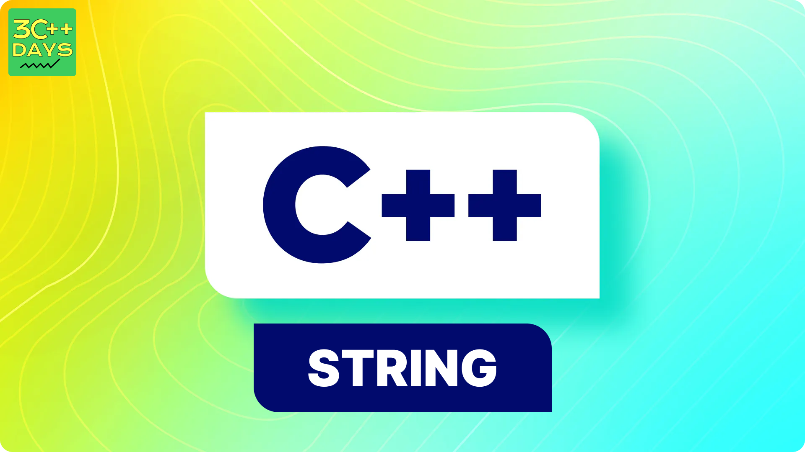

### What is a C-Style Strings in C++?
C-style strings are a fundamental way to represent text data in C programming. They are essentially one-dimensional arrays of characters, terminated by a null character (`\0`). This null character indicates the end of the string and is essential for string manipulation functions to work properly.





**1. Declaration:**

You can declare a C-style string by specifying an array of characters:

```c
char message[50];
```

This creates an array named `message` that can hold up to 49 characters (excluding the null terminator, which takes up one space).

**2. Initialization:**

There are two main ways to initialize C-style strings:

   - **String literal:**

   ```c
   char greeting[] = "Hello, world!";
   ```

   This method directly initializes the array with the characters within the double quotes, including the null terminator at the end.

   - **Assignment:**

   ```c
   char name[20];
   strcpy(name, "Alice");  // strcpy is a library function to copy strings (be cautious of buffer overflows)
   ```

   This assigns the characters from another string (source) to the newly declared array (destination). Remember that `strcpy` doesn't perform any bounds checking, so ensure the destination array has enough space to hold the entire source string and the null terminator.

**3. Accessing Characters:**

You can access individual characters in a C-style string using their index within the array:

```c
char first_letter = message[0];
```

**4. String Length:**

Since C-style strings don't store their length explicitly, you need to determine it by iterating through the array until you encounter the null terminator. Libraries like `strlen` can help with this:

```c
int length = strlen(message);
```

**5. Important Points:**

- C-style strings are not safe for bounds checking. Make sure you allocate enough memory for the entire string before manipulating it to avoid buffer overflows.
- String manipulation functions like `strcpy`, `strcat`, `strcmp`, etc., require careful handling to prevent memory-related issues. Consider using safer alternatives from the C++ Standard Library if possible.

In summary, C-style strings offer a basic way to work with text data in C, but they come with limitations in terms of safety and ease of use. Modern C++ provides more robust string classes that handle memory management and offer safer string manipulation functions.