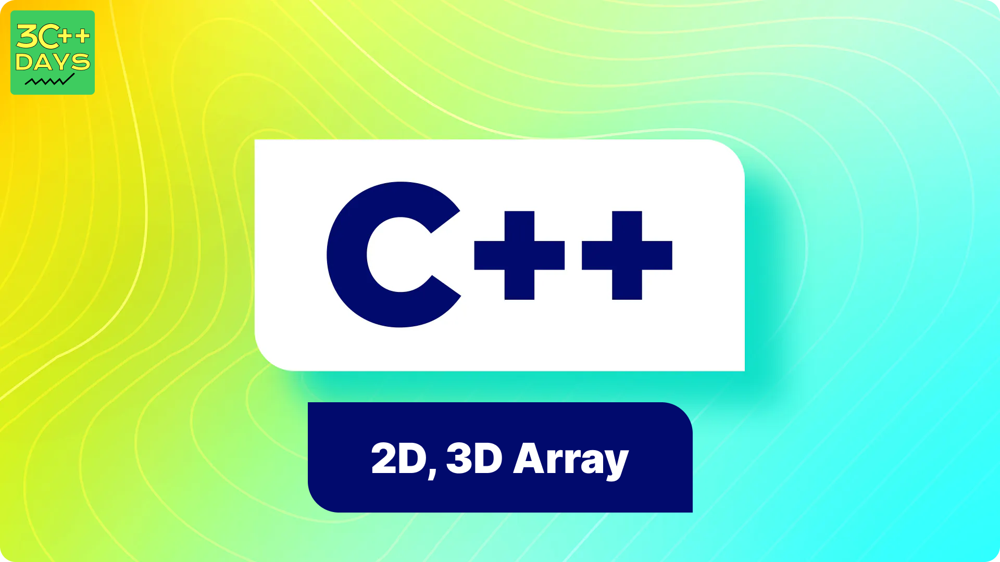

## 1. What is a Single Dimensional Array in C++?

A single dimensional array is a collection of elements of the same data type, stored in contiguous memory locations. Arrays allow you to store multiple values in a single variable, which can be accessed using an index.



## 2. Why Use Arrays?

Arrays are used to:
- Store multiple values of the same type in a single variable.
- Easily access and manipulate a collection of data.
- Efficiently manage memory by storing elements in contiguous memory locations.

## 3. Declaring and Initializing Arrays

You can declare an array by specifying the data type, array name, and size.

**Syntax:**

```cpp
datatype arrayName[arraySize];
```

You can also initialize an array at the time of declaration.

**Example:**

```cpp
#include <iostream>
using namespace std;

int main() {
    int numbers[5];  // Declaration
    int scores[5] = {85, 90, 78, 92, 88};  // Declaration and Initialization
    return 0;
}
```

## 4. Accessing Array Elements

Array elements are accessed using their index. The index of the first element is 0, and the index of the last element is `arraySize - 1`.

**Example:**

```cpp
#include <iostream>
using namespace std;

int main() {
    int scores[5] = {85, 90, 78, 92, 88};
    cout << "First element: " << scores[0] << endl;  // Output: 85
    cout << "Last element: " << scores[4] << endl;   // Output: 88
    return 0;
}
```

## 5. Looping Through an Array

You can use loops to iterate through array elements for processing.

**Example:**

```cpp
#include <iostream>
using namespace std;

int main() {
    int scores[5] = {85, 90, 78, 92, 88};
    for (int i = 0; i < 5; i++) {
        cout << "Element at index " << i << ": " << scores[i] << endl;
    }
    return 0;
}
```

## 6. Modifying Array Elements

You can modify the elements of an array by accessing them via their index.

**Example:**

```cpp
#include <iostream>
using namespace std;

int main() {
    int scores[5] = {85, 90, 78, 92, 88};
    scores[2] = 80;  // Modify the element at index 2
    cout << "Modified element at index 2: " << scores[2] << endl;  // Output: 80
    return 0;
}
```

## 7. Advantages and Disadvantages of Arrays

### Advantages
- **Efficient Data Management**: Arrays allow efficient management and manipulation of data.
- **Ease of Access**: Direct access to any element using its index.
- **Memory Management**: Efficient use of memory by storing elements in contiguous locations.

### Disadvantages
- **Fixed Size**: The size of an array is fixed at compile time and cannot be changed during runtime.
- **Single Data Type**: Arrays can store elements of only one data type.
- **Memory Waste**: If the array size is larger than the required number of elements, memory can be wasted.

## 8. Conclusion

Single dimensional arrays are a fundamental data structure in C++, providing an efficient way to store and manage collections of data. Understanding arrays and their operations is crucial for solving various programming problems effectively.