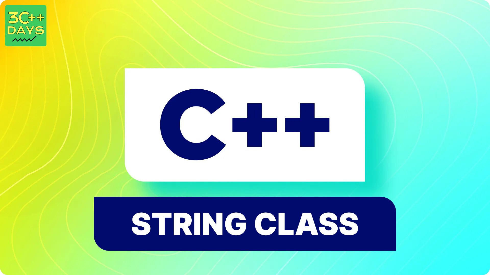

### What is a String Class in C++?
In C++, a string class is a part of the Standard Template Library (STL) that provides a convenient way to work with strings of characters. It encapsulates various string operations and functionalities, making string manipulation easier for developers.


1. What is a String Class in C++?
2. Explain the Syntax of a String Class in C++.
3. How to Declare and Define a String Class in C++?
4. C++ String Class Example
5. How to Input and Output a String Class in C++?
6. How to Concatenate String Classes in C++?
7. what is the std::string class in C++?
8. How do you declare and initialize a std::string in C++?
9. How do you find the length of a std::string?
10. How do you compare two std::string objects in C++?




### Explain the Syntax of a String Class in C++.
The syntax for declaring a string object in C++ is:

```cpp

#include <string>

std::string myString;

```
Here, std::string is the string class, and myString is an instance of the class.

### How to Declare and Define a String Class in C++?
To declare and define a string class in C++, you can simply create an object of the std::string class. 
## Here's how:
```cpp

#include <string>

std::string myString = "Hello, World!";

```

### C++ String Class Example.
Here's a basic example demonstrating the usage of the C++ string class:
```cpp

#include <iostream>
#include <string>

int main() {
    std::string greeting = "Hello, ";
    std::string name = "Tina";
    std::cout << greeting + name << std::endl;
    return 0;
}

```

### How to Input and Output a String Class in C++?
You can use the standard input/output operations to work with string classes in C++.
## Here's an example:

```cpp

#include <iostream>
#include <string>

int main() {
    std::string inputString;
    std::cout << "Enter a string: ";
    std::cin >> inputString;
    std::cout << "You entered: " << inputString << std::endl;
    return 0;
}

```

### How to Concatenate String Classes in C++?
In C++, you can concatenate string classes using the + operator or the append() function.
## Examples of both methods:
```cpp

#include <iostream>
#include <string>

int main() {
    std::string firstString = "Hello, ";
    std::string secondString = "World!";
    
    // Using the + operator
    std::string result1 = firstString + secondString;
    std::cout << "Concatenated string using + operator: " << result1 << std::endl;
    
    // Using the append() function
    firstString.append(secondString);
    std::cout << "Concatenated string using append(): " << firstString << std::endl;
    
    return 0;
}

```
