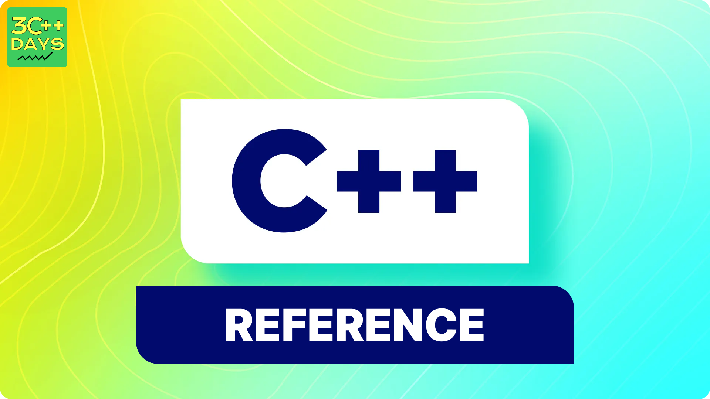

---

sidebar_position: 5
title: "Passing by Reference in C++"
description: "In this tutorial, we will learn about passing by reference in C++ with the help of examples. Passing by reference is a crucial concept for optimizing memory usage and improving performance in C++ programming."
sidebar_label: "Passing by Reference"
slug: passing-by-reference-in-cpp
---

## 1. What is Passing by Reference in C++?

Passing by reference is a method of passing arguments to a function such that the function operates on the actual variables rather than a copy of them. This allows the function to modify the original variables and is more efficient for large data structures.



## 2. Why Use Passing by Reference?

- **Efficiency**: Avoids copying large data structures, saving time and memory.
- **Modify Original Data**: Allows functions to modify the original arguments.
- **Consistency**: Keeps data consistent across different scopes.

## 3. Syntax for Passing by Reference

Passing by reference is done using the reference operator (`&`) in the function parameter list.

**Syntax:**

```cpp
returnType functionName(dataType &parameterName) {
    // Function body
}
```

## 4. Examples

### Example 1: Basic Passing by Reference

In this example, we pass an integer by reference to a function that increments its value.

```cpp
#include <iostream>
using namespace std;

void increment(int &num) {
    num++;  // Modifies the original variable
}

int main() {
    int a = 10;
    increment(a);
    cout << "a: " << a << endl;  // Output: 11
    return 0;
}
```

### Example 2: Passing Objects by Reference

Passing objects by reference can significantly improve performance by avoiding the overhead of copying large objects.

```cpp
#include <iostream>
using namespace std;

class Example {
public:
    int value;
    Example(int v) : value(v) {}
};

void modify(Example &obj) {
    obj.value += 10;
}

int main() {
    Example ex(20);
    modify(ex);
    cout << "ex.value: " << ex.value << endl;  // Output: 30
    return 0;
}
```

## 5. Const References

When you do not want the function to modify the passed argument, use `const` with the reference. This ensures the argument is not changed within the function.

**Syntax:**

```cpp
returnType functionName(const dataType &parameterName) {
    // Function body
}
```

**Example:**

```cpp
#include <iostream>
using namespace std;

void display(const int &num) {
    cout << "Number: " << num << endl;
    // num++;  // Error: Cannot modify a const reference
}

int main() {
    int a = 10;
    display(a);
    return 0;
}
```

## 6. When to Use Passing by Reference

- When you need to modify the original variable.
- When passing large objects to avoid copying overhead.
- When consistency of data across function calls is required.

## 7. Advantages and Disadvantages

### Advantages
- **Performance**: More efficient for large data structures.
- **Modifiability**: Allows functions to modify the original arguments.

### Disadvantages
- **Complexity**: Can make the function interface more complex.
- **Safety**: Requires careful handling to avoid unintended modifications.

## 8. Conclusion

Passing by reference is a powerful feature in C++ that enhances performance and allows functions to modify the original data. Understanding when and how to use it effectively is crucial for efficient C++ programming.