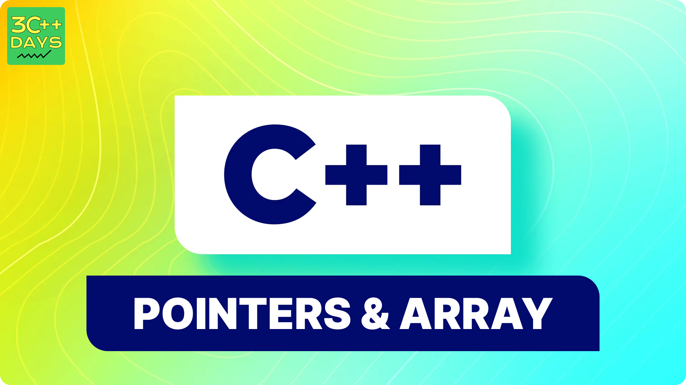

---

sidebar_position: 4
title: "References vs Pointers in C++"
description: "In this tutorial, we will learn about the differences between references and pointers in C++ with the help of examples. Understanding references and pointers is crucial for effective C++ programming."
sidebar_label: "References vs Pointers"
slug: references-vs-pointers-in-cpp
---

## 1. What are References and Pointers in C++?

In C++, both references and pointers are used to refer to memory locations, but they have different properties and uses. 

- **References**: An alias for another variable.
- **Pointers**: A variable that holds the memory address of another variable.



## 2. Declaring References and Pointers

### Declaring References

A reference is declared using the `&` operator.

**Syntax:**

```cpp
datatype &referenceName = variableName;
```

**Example:**

```cpp
#include <iostream>
using namespace std;

int main() {
    int a = 10;
    int &ref = a;  // ref is a reference to a
    cout << "a: " << a << endl;    // Output: 10
    cout << "ref: " << ref << endl;  // Output: 10
    return 0;
}
```

### Declaring Pointers

A pointer is declared using the `*` operator.

**Syntax:**

```cpp
datatype *pointerName;
```

**Example:**

```cpp
#include <iostream>
using namespace std;

int main() {
    int a = 10;
    int *ptr = &a;  // ptr holds the address of a
    cout << "a: " << a << endl;      // Output: 10
    cout << "ptr: " << ptr << endl;  // Output: address of a
    cout << "*ptr: " << *ptr << endl;  // Output: 10
    return 0;
}
```

## 3. Differences Between References and Pointers

### 1. Syntax and Usage

- **References**: Use the `&` operator for declaration and do not require dereferencing.
- **Pointers**: Use the `*` operator for declaration and require dereferencing with `*`.

**Example:**

```cpp
int a = 5;
int &ref = a;  // Reference
int *ptr = &a;  // Pointer
```

### 2. Initialization

- **References**: Must be initialized when declared.
- **Pointers**: Can be declared without initialization and assigned later.

**Example:**

```cpp
int a = 5;
int &ref = a;  // Must be initialized
int *ptr;     // Can be declared without initialization
ptr = &a;     // Assigned later
```

### 3. Reassignment

- **References**: Cannot be reassigned to refer to another variable.
- **Pointers**: Can be reassigned to point to different variables.

**Example:**

```cpp
int a = 5, b = 10;
int &ref = a;  // Reference to a
// ref = b;   // Error: Cannot reassign a reference

int *ptr = &a;  // Pointer to a
ptr = &b;       // Pointer reassigned to b
```

### 4. Null Values

- **References**: Cannot be null.
- **Pointers**: Can be null (useful to indicate that they are not pointing to any valid memory).

**Example:**

```cpp
int a = 5;
int &ref = a;  // Reference cannot be null

int *ptr = nullptr;  // Pointer can be null
ptr = &a;            // Pointer assigned to a valid address
```

### 5. Memory Address

- **References**: Implicitly provide the memory address of the referenced variable.
- **Pointers**: Explicitly hold and can be used to manipulate memory addresses.

**Example:**

```cpp
int a = 5;
int &ref = a;  // Reference to a
int *ptr = &a; // Pointer to a

cout << "Address of a: " << &a << endl;
cout << "Address using ref: " << &ref << endl;
cout << "Address using ptr: " << ptr << endl;
```

## 4. When to Use References and Pointers

### Use References:
- When you need an alias for another variable.
- When you want to avoid null checks and pointer arithmetic.
- For pass-by-reference in function arguments to avoid copying large objects.

### Use Pointers:
- When you need to allocate memory dynamically.
- When you need to implement data structures like linked lists, trees, etc.
- When you need to use null values to indicate "no object".

## 5. Examples

### Example 1: Using References

```cpp
#include <iostream>
using namespace std;

void increment(int &ref) {
    ref++;
}

int main() {
    int a = 10;
    increment(a);
    cout << "a: " << a << endl;  // Output: 11
    return 0;
}
```

### Example 2: Using Pointers

```cpp
#include <iostream>
using namespace std;

void increment(int *ptr) {
    (*ptr)++;
}

int main() {
    int a = 10;
    increment(&a);
    cout << "a: " << a << endl;  // Output: 11
    return 0;
}
```

## 6. Conclusion

Both references and pointers are powerful features in C++ that allow you to manipulate memory and create more efficient programs. Understanding the differences between them and knowing when to use each is crucial for effective C++ programming.