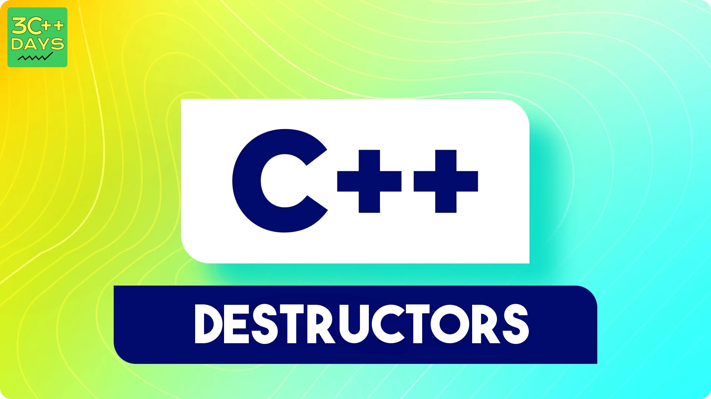

### Definition

Destructor is an instance member function that is invoked automatically whenever an object is going to be destroyed. Meaning, a destructor is the last function that is going to be called before an object is destroyed.



### Syntax
The destructor has the same name as the class preceded by a tilde (~) and does not take any arguments.

```cpp
class Example {
public:
    ~Example() {
        std::cout << "Destructor Called" << std::endl;
    }
};

```
Destructors are essential for releasing resources, such as memory or file handles, that the object may have acquired during its lifetime.