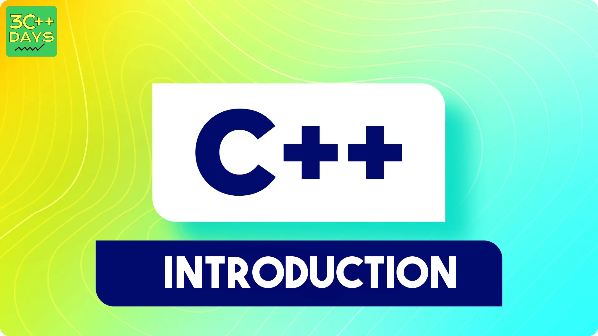

### Definition

A constructor is a special member function that is executed whenever an object of the class is created. Constructors are used to initialize objects.



### Syntax
The constructor has the same name as the class and does not have a return type.

```cpp
class ClassName {
public:
    ClassName() {
        // Constructor body
    }
};
```