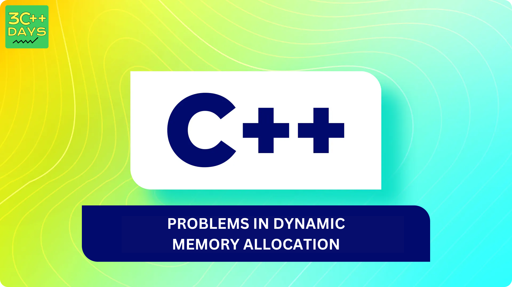

## 1. Memory Leakage
Memory leakage in C++ occurs when memory that is allocated dynamically is not deallocated properly, leading to a loss of memory that cannot be reused by the program. This can result in inefficient memory usage and can eventually cause the program to run out of memory. Memory leaks can be a significant issue, especially in long-running programs or systems where memory resources are limited.

### Failure to Deallocate Dynamically Allocated Memory:
When memory is allocated using the keywords like `new` it is the responsibility of the programmer to deallocate the assigned memory after it is no longer needed, failure in doing so might lead to the memory leakage problem.

```
int main() {
    int *ptr = new int; // Allocate memory
    // No deallocation of memory 
    return 0;
}
```
### Losing the pointer to Dynamically allocated memory
If the memory is allocated dynamically and pointer which is storing the address of the assigned memory gets overwritten without proper deallocation of the allocated memory it leads to memory leakage.

```
int main() {
    int *ptr = new int; // Allocate memory
    ptr = nullptr; // overwriting and losing the reference of allocated memory
    return 0;
}

```


## 2. Dangling pointers
Dangling pointers are pointers that point to memory that has been deallocated, freed, or otherwise invalidated. Accessing or dereferencing a dangling pointer can lead to undefined behavior, crashes, or unexpected results.

When memory allocated using new is deallocated using delete, any pointers pointing to that memory become dangling pointers. If these pointers are accessed or dereferenced after deallocation, it leads to undefined behavior.

```
int* ptr = new int;  // Allocate memory
delete ptr;          // Deallocate memory
// ptr becomes a dangling pointer

```
After memory is deallocated, it can be reused for other purposes. If a dangling pointer is dereferenced after deallocation, it might accidentally access unrelated data stored in the same memory location, leading to unexpected behavior or program crashes.

## 3. External Fragmentation
External fragmentation is a memory management issue that occurs when using dynamic memory allocation (DMA) in C++. It arises when there's sufficient free memory available in total to satisfy a memory allocation request, but the free memory is scattered across multiple non-contiguous blocks. These fragmented blocks are unusable because programs typically require contiguous memory to store data structures.

Even though there's enough total free space to fit a new box (memory allocation request), it might not fit in any of the existing free spaces because they're not contiguous.
This can lead to situations where your program has to request more memory from the operating system even though there's technically "free" memory available.

### Problems due to external fragmentation
* **Reduced Memory Efficiency**: The program might request more memory from the operating system even though there's technically free memory available.
* **Performance Degradation**: Frequent memory allocation requests can lead to performance overhead.
* **Program Crashes**: In severe cases, external fragmentation can make it impossible to allocate memory even when there's seemingly enough free memory, causing program crashes.


