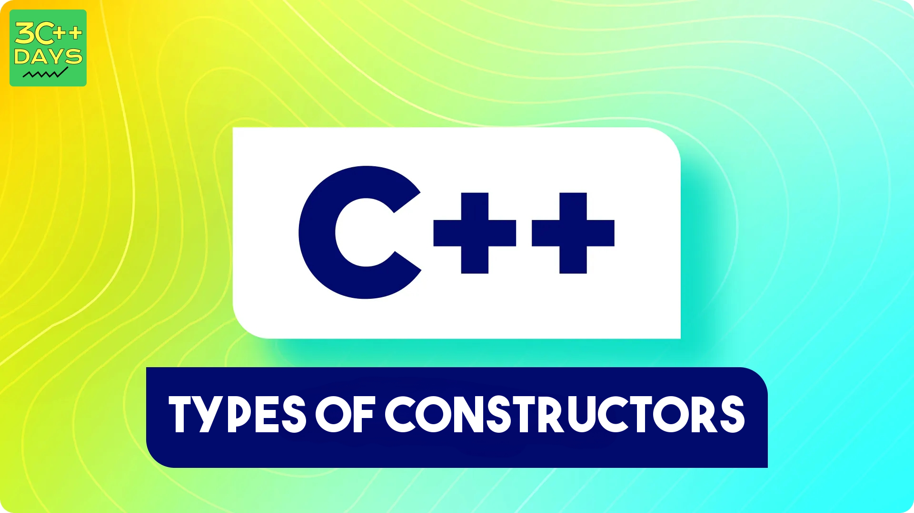

Constructors can be classified based on in which situations they are being used. Each type of constructor serves a different purpose, from providing default values to copying the state from another object.



## 1. Default Constructor
A constructor that takes no arguments.

```cpp
class Example {
public:
    Example() {
        std::cout << "Default Constructor Called" << std::endl;
    }
};
```

## 2. Parameterized Constructor
A constructor that takes arguments to initialize an object with specific values.

```cpp
class Example {
public:
    int value;

    Example(int v) {
        value = v;
        std::cout << "Parameterized Constructor Called with value: " << value << std::endl;
    }
};
```

## 3. Copy Constructor
A constructor that initializes an object using another object of the same class.

```cpp
class Example {
public:
    int value;

    Example(int v) {
        value = v;
    }

    Example(const Example &obj) {
        value = obj.value;
        std::cout << "Copy Constructor Called" << std::endl;
    }
};
```

## 4. Move Constructor
 Move constructors are special member functions used to transfer resources from one object to another. Unlike copy constructors, which create a new copy of an object, move constructors "move" the resources, leaving the original object in a valid but unspecified state.

Move constructors are particularly useful when dealing with resource-intensive objects like those managing dynamic memory, file handles, or network connections.

```cpp
class ClassName {
public:
    ClassName(ClassName&& other) {
        // Move constructor body
    }
};
```


