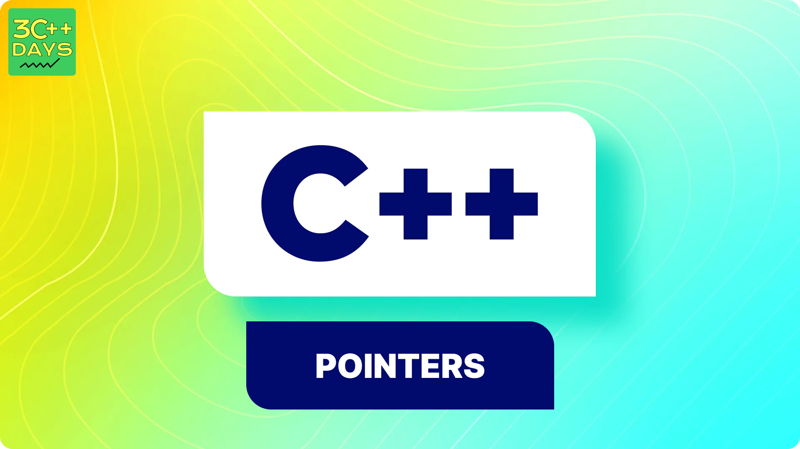

## 1. What is Function Overloading in C++?

Function overloading in C++ allows us to create multiple functions with the same name but different parameters. This enables us to perform different tasks using the same function name, enhancing code readability and reusability.



## 2. Why Use Function Overloading?

Function overloading is useful when:
- We need to perform similar operations on different data types.
- We want to avoid using different function names for similar tasks, thus making the code more intuitive and easier to maintain.

## 3. Syntax of Function Overloading

To overload a function, define multiple functions with the same name but different parameters (different number, type, or order of parameters).

```cpp
void functionName(int a);
void functionName(double a);
void functionName(int a, double b);
```

## 4. Examples of Function Overloading

### 1. Overloading Functions Based on Parameter Type

```cpp
#include <iostream>
using namespace std;

void print(int i) {
    cout << "Printing int: " << i << endl;
}

void print(double f) {
    cout << "Printing float: " << f << endl;
}

int main() {
    print(5);      // Calls the first print function
    print(3.14);   // Calls the second print function
    return 0;
}
```

### 2. Overloading Functions Based on Number of Parameters

```cpp
#include <iostream>
using namespace std;

void display(int a) {
    cout << "Displaying integer: " << a << endl;
}

void display(int a, double b) {
    cout << "Displaying integer and double: " << a << " and " << b << endl;
}

int main() {
    display(5);           // Calls the first display function
    display(5, 3.14);     // Calls the second display function
    return 0;
}
```

### 3. Overloading Functions Based on Parameter Order

```cpp
#include <iostream>
using namespace std;

void show(int a, char b) {
    cout << "Integer: " << a << " and character: " << b << endl;
}

void show(char b, int a) {
    cout << "Character: " << b << " and integer: " << a << endl;
}

int main() {
    show(100, 'A');    // Calls the first show function
    show('B', 200);    // Calls the second show function
    return 0;
}
```

## 5. Rules for Function Overloading

When overloading functions, the compiler must differentiate between the functions based on:
- The number of parameters
- The types of parameters
- The order of parameters

However, you cannot overload functions by only changing the return type.

**Example of Incorrect Overloading:**

```cpp
// This will cause a compile-time error
int multiply(int a, int b);
double multiply(int a, int b);
```

## 6. Benefits of Function Overloading

- **Improves code readability**: Function names are intuitive and consistent.
- **Reduces code complexity**: Similar operations grouped under the same function name.
- **Enhances maintainability**: Easier to manage and understand the code.

## 7. Conclusion

Function overloading is a powerful feature in C++ that enhances the flexibility and readability of the code. By allowing multiple functions with the same name but different parameters, it enables us to write cleaner, more maintainable programs. Understanding and utilizing function overloading effectively can significantly improve your programming skills and efficiency.

---