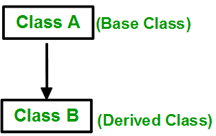
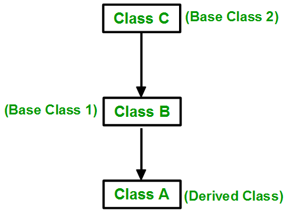
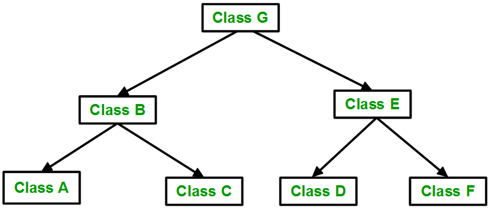
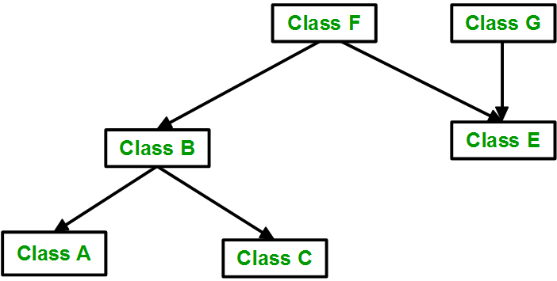

# Inheritance in C++

In C++, inheritance is a process in which one object acquires all the properties and behaviors of its parent object automatically. In such way, you can reuse, extend or modify the attributes and behaviors which are defined in other class.

In C++, the class which inherits the members of another class is called derived class and the class whose members are inherited is called base class. The derived class is the specialized class for the base class.

## Advantage of C++ Inheritance

- **Code reusability:** Now you can reuse the members of your parent class. So, there is no need to define the member again. So less code is required in the class.

## Derived Classes

A Derived class is defined as the class derived from the base class.

The Syntax of Derived class:

```cpp
class derived_class_name :: visibility-mode base_class_name  
{  
    // body of the derived class.  
} 
```

Where,

**derived_class_name:** It is the name of the derived class.

**visibility mode:** The visibility mode specifies whether the features of the base class are publicly inherited or privately inherited. It can be public or private.

**base_class_name:** It is the name of the base class.

- When the base class is privately inherited by the derived class, public members of the base class becomes the private members of the derived class. Therefore, the public members of the base class are not accessible by the objects of the derived class only by the member functions of the derived class.
- When the base class is publicly inherited by the derived class, public members of the base class also become the public members of the derived class. Therefore, the public members of the base class are accessible by the objects of the derived class as well as by the member functions of the base class.

**Note:**

- In C++, the default mode of visibility is private.
- The private members of the base class are never inherited.

## How to make a Private Member Inheritable

The private member is not inheritable. If we modify the visibility mode by making it public, but this takes away the advantage of data hiding.

C++ introduces a third visibility modifier, i.e., protected. The member which is declared as protected will be accessible to all the member functions within the class as well as the class immediately derived from it.

**Visibility modes can be classified into three categories:**

- **Public:** When the member is declared as public, it is accessible to all the functions of the program.
- **Protetcted:** When the member is declared as protected, it is accessible within its own class as well as the class immediately derived from it.
- **Private:** When the member is declared as private, it is accessible within the class only.

## Visibility of Inherited Members


## Types of Inheritance

C++ supports five types of inheritance:

- Single inheritance
- Multiple inheritance
- Hierarchical inheritance
- Multilevel inheritance
- Hybrid inheritance

### Single Inheritance

In single inheritance, a class is allowed to inherit from only one class. i.e. one subclass is inherited by one base class only.



```cpp
// C++ program to explain 
// Single inheritance
#include<iostream>
using namespace std;

// base class
class Vehicle {
  public:
    Vehicle()
    {
      cout << "This is a Vehicle\n";
    }
};

// sub class derived from a single base classes
class Car : public Vehicle {

};

// main function
int main()
{   
    // Creating object of sub class will
    // invoke the constructor of base classes
    Car obj;
    return 0;
}

```
**Output**
```
This is a Vehicle
```

### Multiple Inheritance

Multiple Inheritance is a feature of C++ where a class can inherit from more than one class. i.e one subclass is inherited from more than one base class.


Here, the number of base classes will be separated by a comma (‘, ‘) and the access mode for every base class must be specified.

```cpp
// C++ program to explain
// multiple inheritance
#include <iostream>
using namespace std;

// first base class
class Vehicle {
public:
    Vehicle() { cout << "This is a Vehicle\n"; }
};

// second base class
class FourWheeler {
public:
    FourWheeler()
    {
        cout << "This is a 4 wheeler Vehicle\n";
    }
};

// sub class derived from two base classes
class Car : public Vehicle, public FourWheeler {
};

// main function
int main()
{
    // Creating object of sub class will
    // invoke the constructor of base classes.
    Car obj;
    return 0;
}

```

**Output**
```
This is a Vehicle
This is a 4 wheeler Vehicle
```

### Multilevel Inheritance

In this type of inheritance, a derived class is created from another derived class.



```cpp
// C++ program to implement
// Multilevel Inheritance
#include <iostream>
using namespace std;

// base class
class Vehicle {
public:
    Vehicle() { cout << "This is a Vehicle\n"; }
};

// first sub_class derived from class vehicle
class fourWheeler : public Vehicle {
public:
    fourWheeler()
    {
        cout << "Objects with 4 wheels are vehicles\n";
    }
};
// sub class derived from the derived base class fourWheeler
class Car : public fourWheeler {
public:
    Car() { cout << "Car has 4 Wheels\n"; }
};

// main function
int main()
{
    // Creating object of sub class will
    // invoke the constructor of base classes.
    Car obj;
    return 0;
}

```

**Output**
```
This is a Vehicle
Objects with 4 wheels are vehicles
Car has 4 Wheels
```

### Hierarchical Inheritance

In this type of inheritance, more than one subclass is inherited from a single base class. i.e. more than one derived class is created from a single base class.



```cpp
// C++ program to implement
// Hierarchical Inheritance
#include <iostream>
using namespace std;

// base class
class Vehicle {
public:
    Vehicle() { cout << "This is a Vehicle\n"; }
};

// first sub class
class Car : public Vehicle {
};

// second sub class
class Bus : public Vehicle {
};

// main function
int main()
{
    // Creating object of sub class will
    // invoke the constructor of base class.
    Car obj1;
    Bus obj2;
    return 0;
}

```

**Output**
```
This is a Vehicle
This is a Vehicle
```

### Hybrid (Virtual) Inheritance

Hybrid Inheritance is implemented by combining more than one type of inheritance. For example: Combining Hierarchical inheritance and Multiple Inheritance. 
Below image shows the combination of hierarchical and multiple inheritances:



```cpp
// C++ program for Hybrid Inheritance

#include <iostream>
using namespace std;

// base class
class Vehicle {
public:
    Vehicle() { cout << "This is a Vehicle\n"; }
};

// base class
class Fare {
public:
    Fare() { cout << "Fare of Vehicle\n"; }
};

// first sub class
class Car : public Vehicle {
};

// second sub class
class Bus : public Vehicle, public Fare {
};

// main function
int main()
{
    // Creating object of sub class will
    // invoke the constructor of base class.
    Bus obj2;
    return 0;
}

```

**Output**
```
This is a Vehicle
Fare of Vehicle
```