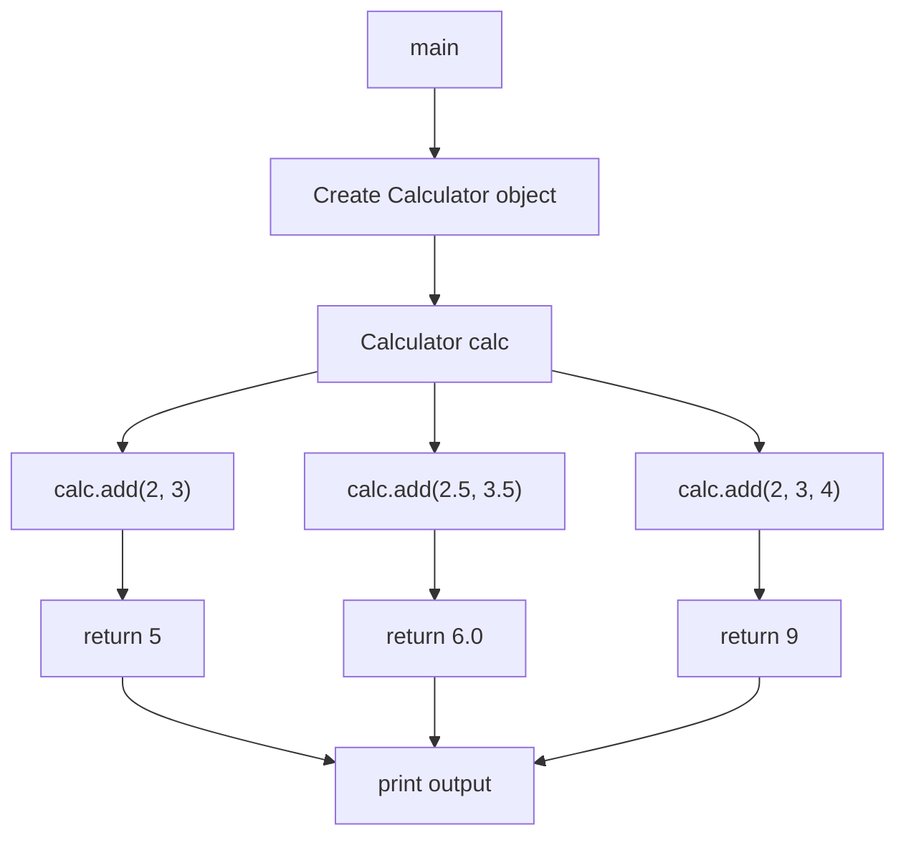
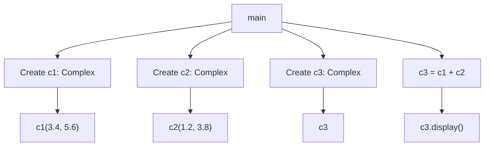
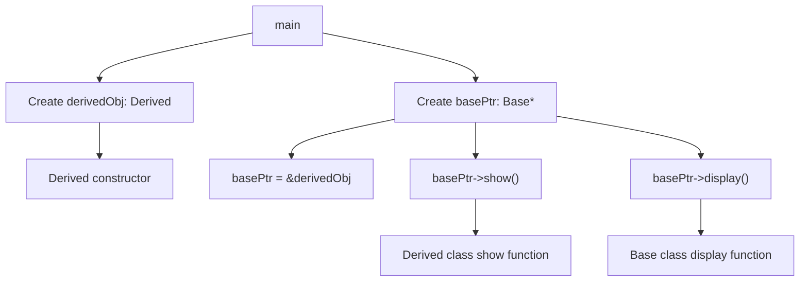

# Polymorphism

Polymorphism in C++ is a key concept of object-oriented programming that allows objects to be treated as instances of their parent class rather than their actual class. It provides a way to use a single interface to represent different underlying forms (data types). There are two types of polymorphism in C++: compile-time (or static) polymorphism and run-time (or dynamic) polymorphism.

## 1. Compile Time Polymorphism

### Function Overloading

Function overloading allows multiple functions with the same name but different parameters to exist within the same scope. The correct function to call is determined at compile time based on the number and type of arguments.

```cpp
#include <iostream>

class Calculator {
public:
    int add(int a, int b) {
        return a + b;
    }

    double add(double a, double b) {
        return a + b;
    }

    int add(int a, int b, int c) {
        return a + b + c;
    }
};

int main() {
    Calculator calc;
    std::cout << calc.add(2, 3) << std::endl;  // Output: 5
    std::cout << calc.add(2.5, 3.5) << std::endl;  // Output: 6.0
    std::cout << calc.add(2, 3, 4) << std::endl;  // Output: 9
    return 0;
}
```

Above code can be viewed as :



### Operator Overloading

Operator overloading allows us to define the way operators work for user-defined types.

```cpp
#include <iostream>
using namespace std;

class Complex {
private:
    float real;
    float imag;
public:
    Complex() : real(0), imag(0) {}
    Complex(float r, float i) : real(r), imag(i) {}

    Complex operator + (const Complex &obj) {
        Complex temp;
        temp.real = real + obj.real;
        temp.imag = imag + obj.imag;
        return temp;
    }

    void display() {
        cout << "Real: " << real << " Imaginary: " << imag << endl;
    }
};

int main() {
    Complex c1(3.4, 5.6), c2(1.2, 3.8), c3;
    c3 = c1 + c2;

    c3.display();

    return 0;
}
```

Above code can be viewed as,



## 2. Runtime Polymorphism 

### Function Overriding

Function overriding allows a derived class to provide a specific implementation of a function that is already defined in its base class.

```cpp
#include <iostream>
using namespace std;

class Base {
public:
    virtual void show() {
        cout << "Base class show function" << endl;
    }

    void display() {
        cout << "Base class display function" << endl;
    }
};

class Derived : public Base {
public:
    void show() override {
        cout << "Derived class show function" << endl;
    }

    void display() {
        cout << "Derived class display function" << endl;
    }
};

int main() {
    Base *basePtr;
    Derived derivedObj;
    basePtr = &derivedObj;

    basePtr->show();       // Runtime Polymorphism
    basePtr->display();    // No Runtime Polymorphism

    return 0;
}
```

Above code can be viewed as,


