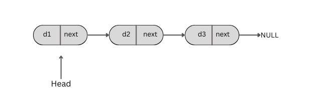
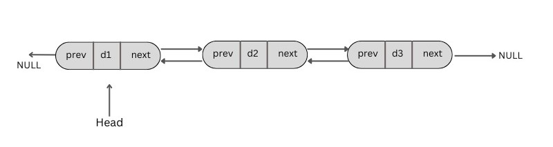
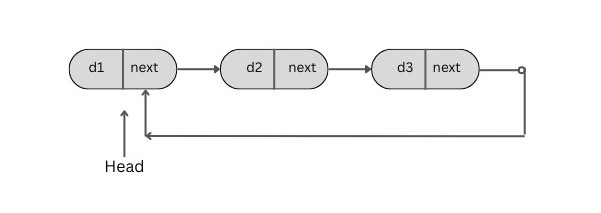
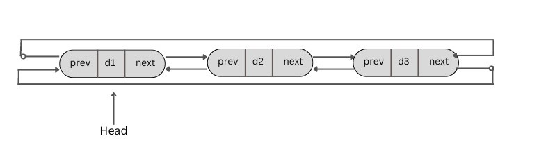

# Linked List in C++
Linked list is a **liner data structure** which stores data in **non-contiguous memory** locations.It has nodes which consist of data and pointer. The data contains the value that you want to add and pointer contains the address to the next node.
### Representation of a Node in the Linked List
```
struct Node{
    int data;
    Node* next;
}
```
`Data` : Values to be stored.\
`Next` : Pointer to next node.

As you cannot access the linked list using index, so we have a `head` which stores the address of the start of the linked list. 

## Types of Linked List
There are several types of linked list :
1. **Singly Linked List**.\
In singly linked list there is only one pointer which points to the next node and the last node points to null. To access or print out the list, you start at the head and move from node to node by following each node’s next pointer.
<br></br>

<br></br>

2. **Doubly Linked List**\
In doubly linked list we have three components inside the node. These are data, next pointer and previous pointer. This is advances version of singly linked list as this structure allows traversal of the list in both directions, making operations like insertion and deletion more efficient near both ends of the list, as you can easily access the previous node.<br></br>

<br></br>

3. **Circular Linked List**\
In this type of linked list, the nodes are connected together in circular form thus there is no node pointing to NULL. Each node points to the next node and the last node points back to the first node, forming a single circle.
<br></br>

<br></br>

4. **Circular Doubly Linked List**
This linked list is a combination of Doubly linked list and Circular linked list. In this also we have three components of node. The data contains the value, next contains pointer to next node and prev points to previous node.The last node’s next pointer points to the first node, and the first node’s previous pointer points to the last node, creating a circular doubly linked structure. This allows for traversal in both directions indefinitely.<br></br>

<br></br>

## Applications of Linked Lists :
Some of the applictaions of linked list are as follow :
- **Implementation of stacks and queues:** Linked can be used for efficient insertion and deletion.
- **Hash table :** Linked list can prevent collisions in hash tables by chaining.
- **Graphs :** Adjacency lists for graphs are often represented with linked lists.
- **Dynamic Memory Allocation :** Used in the implementation of memory management schemes.
- **Web Browsers :** Linked lists are used in web browsers to keep track of the history of visited web pages.
- **Music and Image Viewers :** For previous and next functionalities.

## Advantages of Linked List
Linked lists offer several advantages over other data structures like arrays. Here are some key benefits:

- **Dynamic Size :** Unlike arrays, linked lists are dynamic and can grow or shrink in size.
- **Ease of Insertion/Deletion :** Addition or removal of elements doesn’t require shifting elements, as in arrays.
- **No Memory Wastage :** They allocate memory as needed, so there’s no unused memory.
- **No Size Limitation :** You’re not limited by an initial size declaration, unlike static arrays.
- **Implementation of Advanced Structures :** Useful in implementing stacks, queues, graphs, etc.
## Disadvantages of Linked List
While linked lists have several advantages, they also come with some drawbacks :

- **Memory Usage :** Each node requires extra memory for a pointer, which can be significant for large lists.
- **Traversal :** Direct access is not possible; you must traverse the list from the beginning to reach a particular element.
- **Reverse Traversing :** In singly linked lists, reverse traversing is not possible without extra space for back pointers.
- **Complexity :** Operations like sorting and searching can be more complex and less efficient than with arrays.


