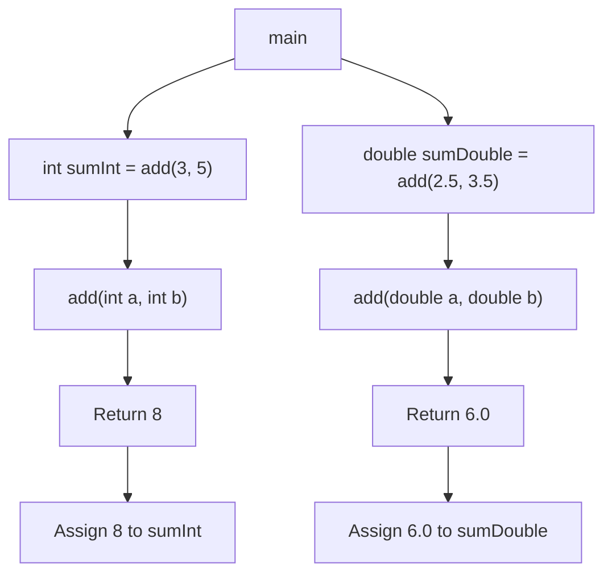
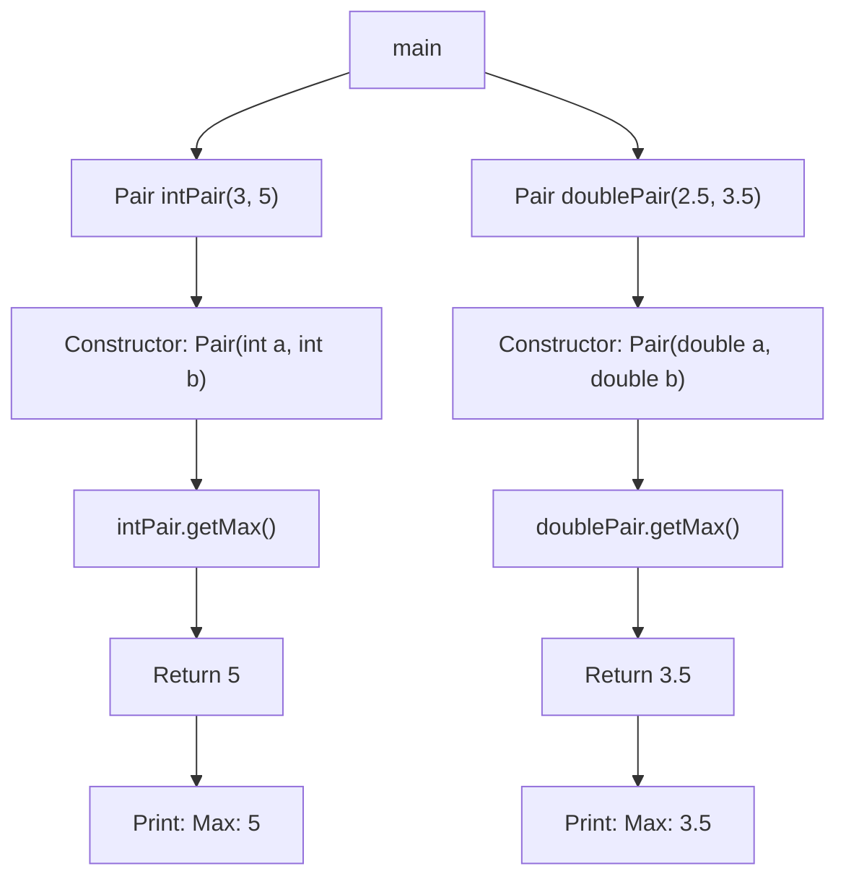

# Templates  in C++

Templates in C++ provide a way to write generic programs that can work with any data type. They allow you to create functions and classes that can handle different data types without having to rewrite the code for each type separately.

## Function Template

Function templates allow you to define a single function that can work with different data types. 

Syntax:
```cpp
template <typename T>
T functionName(T param1, T param2) {
    // Function body
}
```

- `template <typename T>`: This line declares a template with a template parameter T, which represents a placeholder for the type.
- `T functionName(T param1, T param2) { ... }`: This defines a function functionName that takes two parameters of type T and returns a value of type T.

Example: 
```cpp
// Function template example
template <typename T>
T add(T a, T b) {
    return a + b;
}

int main() {
    int sumInt = add(3, 5);           // T is deduced as int
    double sumDouble = add(2.5, 3.5); // T is deduced as double

    return 0;
}
```

Above code can be viewed as,



## Class Templates

Class templates allow you to define a generic class where one or more data members or member functions can be of generic types.

Syntax: 
```cpp
template <typename T>
class ClassName {
public:
    T memberFunction(T param);
    // Other member declarations
};
```

Example :

```cpp
// Class template example
template <typename T>
class Pair {
private:
    T first;
    T second;
public:
    Pair(T a, T b) : first(a), second(b) {}
    T getMax();
};

template <typename T>
T Pair<T>::getMax() {
    return (first > second) ? first : second;
}

int main() {
    Pair<int> intPair(3, 5);
    cout << "Max: " << intPair.getMax() << endl;    // Output: Max: 5

    Pair<double> doublePair(2.5, 3.5);
    cout << "Max: " << doublePair.getMax() << endl; // Output: Max: 3.5

    return 0;
}
```

Above code can be viewed as,


