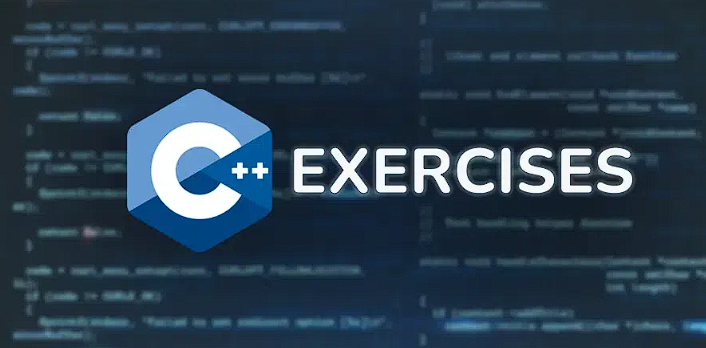

# Easy Practice Problems in C++

Do you want to improve your command on C++ language? Explore our vast library of C++ exercise questions, which are specifically designed for beginners as well as for advanced programmers. We provide a large selection of coding exercises that cover every important topic, including classes, objects, arrays, matrices, and pointers. Master C++ with our practical approach and practice C++ exercises online



## C++ Exercise Problems
There are over 20+ C Exercise questions for you to practice along with the solutions to every question for a better understanding. You can solve these questions online in GeeksforGeeks IDE.

**Q1. Write a Program to Print “Hello World” in the Console Screen.**
Write a simple program that prints the words “Hello World” on the console.


For Example,
```
Output: Hello World
```

**Q2. Write a Program to Read and Print Number Input From the User.**
In this problem, you have to create a simple program that reads a number that is entered by the user and prints it on the console screen.

For Example,

```
Input: Enter any Number: 25

Output: Entered Number: 25
```

**Q3. Write a Program to Print the ASCII Value of a Character.**
In C++, each character has some ASCII value associated with it. In this problem, we have to print the ASCII value of the character in the console.

For Example,
```
Character =  A

Output: ASCII Value of 'A' = 65
```

**Q4. Write a Program to Swap Two Numbers.**
You have to create a program that swaps the value of two number variables. It means that the value of the first variable will be stored in the second variable and the value of the second variable should be stored in the first variable.

For Example,
```cpp
// Variables initally
a = 10, b = 250

// After execution
Output: a = 250, b = 10
```

**Q5. Write a Program to Find the Size of int, float, double, and char.**
In C++, each datatype requires some memory to store data. In this program, you have to print the required memory (i.e. size in bytes) for int, float, double, and char data types on the console.

For Example,
```cpp
Output
size of int: 10 bytes
size of float: 20 bytes
size of double: 30 bytes
size of char: 40 bytes
```

**Q6. Write a Program to Find Compound Interest.**
In this problem, you have to write a program that calculates and prints the compound interest for the given Principle, Rate of Interest, and Time.

For Example,
```cpp
Principle = 25000
Rate = 12%
Time = 5 Years

Output: Compound Interest = 19058.54
```

**Q7. Write a Program to Check Even or Odd Integers.**
In this problem, we have to simply check whether the given integer is odd or even and print the output on the console.

For Example,
```cpp
Number = 28

Output: 28 is Even Number.
```

**Q8. Write a Program to Find the Largest Among 3 Numbers.**
In this problem, you are given 3 numbers, and you have to find out which one is the largest.

For Example,
```cpp
Given Numbers: a = 10, b = 21 and c = 4

Output: b is the largest.
```

**Q9. Write a Program to Check if a Given Year Is a Leap Year.**
In this problem, you have to write a program that takes a year as an input, and then checks whether it is a leap year or not.

For Example,
```cpp
Input: 2020

Output: 2020 is a Leap Year
```

**Q10. Write a Program to Check Whether a Number Is Prime or Not.**
The number can be prime or non-prime based on the number of its factors. In this program, we have to check whether the given number is prime or not and print the result on the console screen.

For Example,
```cpp
Number to Check = 29

Output: 29 is a prime number.
```

**Q11. Write a Program to Check Whether a Number Is a Palindrome or Not.**
A palindrome number is a number that is equal to itself even after reversing its digits. In this program, we have to check for palindrome numbers.

For Example,
```cpp
Number to Check = 1231

Output: 1231 is not a palindrome number.
```

**Q12. Write a Program to Make a Simple Calculator.**
In this problem, you have to make a program that can perform addition, subtraction, multiplication, and division on two numbers entered by the user. The type of arithmetic operation can also be selected by the user.

For Example,
```cpp
Input:
Enter the Number: 10    25
Enter a for addition,
s for substraction,
m for multiplication,
d for division.

{{if m is entered}}

Output:  250
```

**Q13. Write a Program to Reverse a Sentence Using Recursion.**
In this program, you have to simply reverse the sentence stored as a string.

For Example,
```cpp
Sentence = "Quick brown fox";

Output: xof nworb kciuQ
```

**Q14. Write a Program for Fibonacci Numbers Using Recursion.**
The Fibonacci Series is a mathematical sequence in which the next number is the sum of the last two numbers in the sequence. In this program, you will have to print the Nth number in the sequence using recursion.

For Example,
```cpp
N = 12

Output: 144
```

**Q15. Write a Program to Swap Two Numbers Using a Function.**
In this program, you have to swap the values of two variables using another function.

For Example,
```cpp
// in main function
a = 10, b = 22

Output: a = 22, b = 10
```

**Q16. Write a Program to Check if Two Arrays Are Equal or Not.**
An array is said to be equal if the elements at the given index are equal in both arrays. In this program, you have to take two arrays, and then check whether the two arrays are equal.

For Example,
```cpp
arr1[] = {5, 8, 3}
arr2[] = {5, 8, 11, 2}

Output: arr1[] and arr2[] are not equal.
```

**Q17. Write a Program to Calculate the Average of All the Elements Present in an Array.**
In this problem, you have to calculate the average of all the elements present in the array and print it on the console screen.

For Example,
```cpp
arr[] = {10, 22, 45, 11}

Output: Average = 24.5
```

**Q18. Write a Program to Find the Maximum and Minimum in an Array.**
In this problem, you have to find both maximum(largest) and minimum(smallest) numbers in a numerical array.

For Example,
```cpp
arr[] = {10, 12, 45, 48, 22, 18}

Output:
Maximum = 48
Minimum = 10
```

**Q19. Write a Program to Search an Element in an Array (Linear Search).**
In this program, you have to search for the given element in an array. If the element is found, you will print the index of the element. The array is unsorted.

For Example,
```cpp
arr[] = {10, 11, 7, 8, 2, 9};
Element to be Searched: 19

Output: 19 not found in the arr[]
```

**Q20. Write a Program to Print the Array After It Is Right Rotated K Times.**
Array Rotation means shifting the elements n positions to left or right. In this problem, you will have to rotate the array in the right direction k number of times.

For Example,
```cpp
arr[] = {10, 11, 7, 33, 5, 1};
K = 3

Output: Array after rotation: {33, 5, 1, 10, 11, 7}
```

**Q21. Write a Program to Compute the Sum of Diagonals of a Matrix.**
In this problem, you have to calculate the Sum of both the diagonal elements of a matrix. Matrix are generally represented as 2D arrays.

For Example,
```cpp
matrix = 1   2   3
               4   5   6
               7   8   9
```      
Output:
```cpp 
Principal Diagonal = 16
Secondary Diagonal = 15
```

**Q22. Write a Program to Rotate the Elements of a Matrix.**
We can rotate the matrix in two ways: clockwise and anticlockwise. In this problem, you have to rotate the elements of the matrix in the clockwise direction for K number of times.

For Example,
```cpp
matrix = 1   2   3
       4   5   6
       7   8   9
K = 2
```
Output:
```cpp
Matrix = 7   4   1
       8   5   2
       9   6   3
```

**Q23. Write a Program to Find the Length of a String.**
The length of the string is the number of characters in a string except the NULL character. Write a simple program to find the length of a string and print it on the console.

For Example,
```cpp
str = "Dhairyagothi"
```
```
Output: Length of str = 12
```

**Q24. Write a Program to Compare Two Strings.**
In this problem, you have to write a program to compare two strings to check whether they are the same or not.

For Examples,
```cpp
str1 = "Geeks"
str2 = "geeks"

Output: str1 and str2 are not equal.
```

**Q25. Write a Program to Check if the String Is Palindrome.**
Similar to a palindrome number, a palindrome string is a string that is equal to its reverse. You have to write a program to check whether the given string is a palindrome string or not.

For Example,
```cpp
str = "naman"

Output: str is a palindrome string.
```