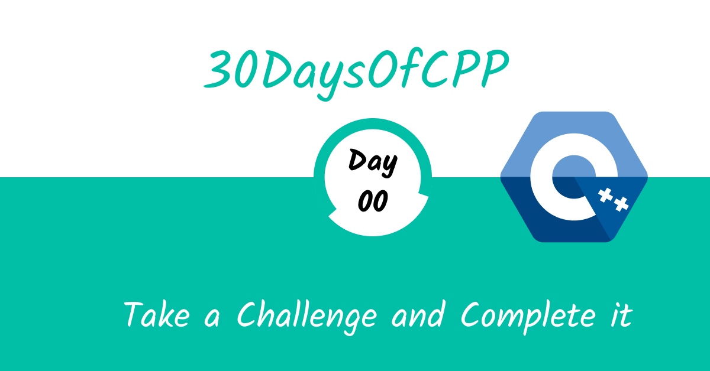

# Introduction to 30 Days of CPP

Congratulations on deciding to participate in 30 days of CPP programming challenge. In this challenge you will learn everything you need to be a CPP programmer, and in general, the whole concept of programming. In case you need help or if you would like to help others you may join the [Whatsapp Channel](https://whatsapp.com/channel/0029Vaf19w1CsU9VVaQr8e20).

30DaysOfCPP challenge is a guide for both beginners and advanced CPP programmers. Welcome to CPP-30. CPP is the language of the Embeded Software. I enjoy using and teaching CPP and I hope you will do so too.

In this step by step CPP challenge, you will learn CPP, the most popular programming language in the history of mankind. CPP is used to add interactivity to websites, to develop mobile apps, desktop applications, games and nowadays CPP can be used for machine learning and AI. CPP (JS) has increased in popularity in recent years and has been the leading programming language for six consecutive years and is the most used programming language on Github.
